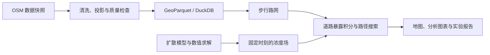

# Flow：本地扩散与路径分析实验室

## 1. 对这个想法的判断

**值得做。更适合你的定位是：用地图展示数据处理、数学建模和算法实验的完整过程。**

“本地 Google Maps”作为长期产品想象可以保留，但第一版围绕一个具体问题：

> 在一个假设的扩散场中，从 A 到 B，多走一些路，能减少多少模型暴露量？这个结果对扩散速度、时间和路线偏好有多敏感？

这个方向把你想展示的能力自然连接起来：

| 能力 | 项目中的实际体现 | 能用于求职的证据 |
|---|---|---|
| 数据工程 | 获取道路数据、清洗、空间转换、构建分析表 | 可重复运行的数据管线、质量报告 |
| 图论与算法 | 构建带权路网，实现 Dijkstra 和 A* | 正确性对照、搜索规模与运行时间 |
| PDE | 建立初边值问题，解释参数与边界 | 模型推导、假设和适用范围 |
| 数值分析 | 离散方程、选择时间步长、分析误差 | 守恒检查、解析解对照、收敛曲线 |
| 数据分析 | 比较不同参数下的路线和暴露量 | 可复现的实验、图表和解释 |

**第一版对算法和科学计算的展示最直接。** 数据工程能展示规范性，但单机小区域还不能证明大规模平台经验；数据分析能展示实验设计，但真实预测能力需要以后接入观测数据。

你可以用同一个项目申请三个方向，分别突出不同证据。前端由 AI 完成没有问题，你最需要亲自掌握的是：模型为什么成立、算法为什么正确、实验结果说明了什么。

## 2. 第一周做出的产品

默认做一个在本机浏览器打开的应用，准备完依赖和数据后可以断网运行。

**一次完整演示：**

1. 打开地图，选择起点、终点和一次释放的位置。
2. 调整扩散系数，运行模拟。
3. 拖动时间轴，查看扩散场。
4. 同时显示最短路线和考虑模型暴露量的路线。
5. 调整路线偏好，比较距离、预计步行时间、模型暴露量。
6. 打开实验面板，查看权衡曲线、数值误差和计算耗时，导出结果。

界面采用“中央地图、左侧参数、右侧结果、底部时间轴”。另设一个简洁的实验报告页，展示数据质量和验证结果。

第一版范围固定为：

- **一个区域**：默认旧金山 Mission 周边约 4 × 4 km，便于获得多条可选路径。
- **一种出行方式**：步行，模型速度固定为 1.4 m/s。
- **一个模型**：二维纯扩散，一次高斯形初始释放。
- **一种路线问题**：在选定时刻冻结扩散场，计算静态最优路线。
- 地图和报告明确标注“理想化扩散实验”；建筑、地形和风暂不参与计算。

全球地图、地址搜索、实时交通、桌面安装包、多用户和真实污染预测放在后续版本。

## 3. Demo 技术栈与计算设计

### 技术栈

| 层次 | 选择 | 用途 |
|---|---|---|
| 前端 | **React + TypeScript + Vite** | 地图页面、参数面板、结果展示 |
| 地图 | **MapLibre GL JS + PMTiles** | 本地底图、道路和扩散图层 |
| 图表 | **Apache ECharts** | 权衡曲线、误差曲线、性能比较 |
| 本地服务 | **Python 3.12 + FastAPI + Uvicorn** | 提供计算接口和本地资源 |
| 数据获取 | **OSMnx** | 获取、整理和保存 OSM 步行路网 |
| 空间处理 | **GeoPandas + Shapely + pyproj** | 道路几何、区域裁剪、坐标转换 |
| 存储与分析 | **GeoParquet + DuckDB Spatial** | 道路表、实验结果、SQL 分析 |
| 算法与数值 | **NumPy + SciPy；NetworkX 作对照** | 扩散求解、插值、图算法验证 |
| 验证 | **pytest + 少量浏览器流程检查** | 数学正确性、接口和离线运行 |

OSMnx 已支持道路图构建、投影和本地保存，可以把精力留给算法和模型。[OSMnx 官方文档](https://osmnx.readthedocs.io/en/stable/getting-started.html)

MapLibre 可以通过 PMTiles 插件读取本地底图；完整离线还需要本地样式、字体和图标资源。[PMTiles 集成文档](https://docs.protomaps.com/pmtiles/maplibre)、[离线地图资源说明](https://docs.protomaps.com/basemaps/maplibre)

**第一周计算核心全部使用 Python。** 你会 C++ 是后续优势：先测性能，再选择一个实际瓶颈，用 C++ 实现并比较速度、内存和结果一致性。这样优化本身也能成为作品证据。

### 数据流与接口

- 数据准备阶段保存原始快照、查询范围、获取日期和文件哈希；清洗后生成节点表、道路边表。
- 路网保留方向、平行边和完整道路折线；长度与数值计算统一使用米制投影。默认区域使用 `EPSG:32610`。
- DuckDB 汇总道路长度、连通分量、无效几何和实验统计；Spatial 扩展在准备阶段安装，运行时从本地加载。[DuckDB Spatial 文档](https://duckdb.org/docs/current/core_extensions/spatial/overview)
- FastAPI 提供三组功能接口：运行模拟并返回编号与时间帧；按模拟编号和时间帧比较路线；读取与导出实验结果。
- 路线响应包含 GeoJSON、距离、时间、暴露积分、目标函数值和算法耗时。模拟参数和数据版本随结果保存，支持重现。
- 服务仅监听本机。前端资源、地图资源和计算接口统一由本地服务提供。

底图从允许区域提取的数据源准备，保留署名；不批量缓存 OSM 标准在线瓦片，其政策禁止这种离线下载方式。[Protomaps 区域下载](https://docs.protomaps.com/basemaps/downloads)、[OSM 瓦片政策](https://operations.osmfoundation.org/policies/tiles/)

### 数学模型

令 \(c(x,y,t)\) 为**无量纲相对浓度**：

\[
\frac{\partial c}{\partial t}
=\kappa\left(
\frac{\partial^2c}{\partial x^2}
+\frac{\partial^2c}{\partial y^2}
\right).
\]

采用高斯形初始分布，初始峰值为 1、宽度参数为 250 m；矩形计算域采用零通量边界。这个边界是实验假设，应在模型说明中解释。

默认计算设置：

- 网格：\(160\times160\)，间距 \(h=25\) m。
- 扩散系数：默认 \(\kappa=20\ \mathrm{m^2/s}\)，界面范围 5–50。
- 时间：0–30 分钟，每 30 秒保存一帧。
- 数值方法：单元中心网格、保守五点空间离散、显式 Euler 时间推进。
- 内部使用双精度；时间步长自动满足  
  \[
  \Delta t\leq0.9\frac{h^2}{4\kappa},
  \]
  并缩短末步以准确到达输出时刻。

该方法简单，但足以展示离散推导、稳定性和收敛性；二维显式扩散格式的步长限制有明确理论依据。[有限差分教材](https://hplgit.github.io/fdm-book/doc/pub/book/html/._fdm-book012.html)

### 从扩散场到路线

在选定时刻 \(t^\*\)，定义道路 \(e\) 的模型暴露积分：

\[
D_e=\int_e c(x,y,t^\*)\,\frac{ds}{v},
\qquad
w_e=\frac{\ell_e}{v}+\lambda D_e.
\]

其中，\(\ell_e\) 是道路长度，\(v=1.4\ \mathrm{m/s}\)，\(\lambda\geq0\) 表示愿意为降低模型暴露量付出的绕行代价。

- 沿完整道路折线按弧长采样，用双线性插值和梯形积分计算 \(D_e\)；采样间距不超过半个网格。
- \(\lambda=0\) 得到最短路线；增大 \(\lambda\) 后比较时间与暴露积分的变化。
- 浓度尺度始终固定，不按每一帧的最大值重新归一化。
- 自己实现 Dijkstra/A*，NetworkX 用于核对最优成本。
- A* 使用“直线距离 ÷ 步行速度”作为下界；非负暴露惩罚保证该下界可用。启发式高估会破坏最优性。[NetworkX A* 文档](https://networkx.org/documentation/stable/reference/algorithms/generated/networkx.algorithms.shortest_paths.astar.astar_path.html)

这些路线只在导入的道路图和冻结场假设下最优。时间轴用于比较不同快照，首版不计算沿行走过程持续变化的实际暴露。

## 4. 一周实施安排

按约 **25–35 小时有效开发投入**估算，AI 并行辅助前端与工程连接。

| 时间 | 工作 | 当天完成标准 |
|---|---|---|
| 第 1 天 | 建立项目、下载区域数据、整理离线资源 | 能断网打开地图，生成数据质量摘要 |
| 第 2 天 | 构建路网，实现 Dijkstra/A* | 两点路径可用，与参考实现成本一致 |
| 第 3 天 | 实现扩散求解器和数学验证 | 扩散结果、质量守恒和解析解检查通过 |
| 第 4 天 | 道路积分、场与路线耦合 | 能比较两条路线及其指标 |
| 第 5 天 | 完成参数面板、时间轴和结果图表 | 用户能完成完整演示流程 |
| 第 6 天 | 参数扫描、算法基准、收敛实验 | 实验结果可保存、查询和导出 |
| 第 7 天 | 离线验收、修复、说明文档和演示录制 | 一键启动，附可复现报告和短视频 |

如果进度吃紧，先减少动画和视觉装饰，保留数学验证、路线比较和实验导出。

## 5. 验收与后续深化

**数学与算法必须通过：**

- 常量场保持不变；零通量条件下相对质量漂移低于 \(10^{-10}\)；非负初值不会产生显著负浓度，不用截断负数掩盖问题。
- 使用满足同样边界条件的余弦解析解，在 \(32^2、64^2、128^2\) 网格上验证误差。取 \(\Delta t=0.1h^2\)、无量纲 \(\kappa=1\)，预期联合收敛阶接近 2；同时明确时间格式本身只有一阶。
- Dijkstra、A* 与 NetworkX 的最优成本一致，允许并列最优时路线不同。
- 零浓度或 \(\lambda=0\) 时回到最短路线；覆盖同一起终点、不可达、平行边和区域外点击。
- 路线积分通过常量场检查：应满足 \(D=cT\)。

**分析和产品必须完成：**

- 固定数据与起终点，扫描 \(\lambda=0,0.5,1,2,5,10\)，生成绕行时间与暴露量权衡曲线；它是采样到的权衡结果，不宣称找到了完整 Pareto 前沿。
- 比较多个扩散时刻和系数，报告结果的敏感性，不预先承诺某个改善百分比。
- 记录求解、道路积分和路径搜索各自耗时；默认规模以路线响应低于 0.5 秒、模拟低于 5 秒为优化目标，最终报告实测值和机器配置。
- 清空浏览器缓存并断网后，地图文字、模拟、路线与导出仍正常。
- 交付可运行 demo、数据质量摘要、数值验证报告、分析报告和约两分钟演示视频。

第一周完成后，按以下顺序深化：先加入对流项与隐式方法对照，再针对实测瓶颈做 C++ 优化，最后接入观测数据进行参数估计和留出验证。数据工程方向则逐步增加多区域导入、增量更新和规模测试。
