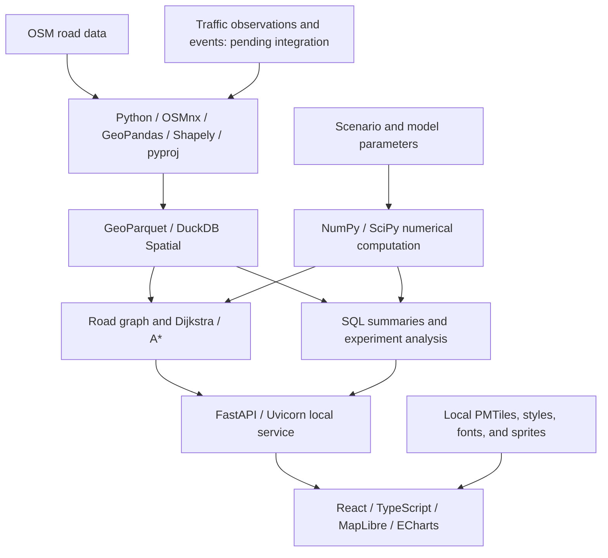

# Flow

A local mapping and computational analysis project that brings data engineering, graph algorithms, data analysis, and numerical PDE methods into an interactive map. Built for learning, experimentation, and a technical portfolio.

## Project Status

Flow is in the planning stage. The repository currently contains design documents, with no application code, dependency manifests, or runnable demo. The technologies below are planned choices, not installed dependencies or completed integrations.

- [Initial development plan and one-week schedule](PLAN_1.md) (in Chinese): a two-dimensional diffusion field, a walking network, and route trade-off experiments.
- Traffic extension: use official Caltrans data to explore traffic replay, congestion analysis, and a single-corridor traffic-flow model. PeMS account access has been granted; data integration, corridor coverage, and data quality still need validation.
- Delivery model: a browser connects to a service running on the local machine. Data is retrieved while online; computation and replay work offline once the required data and assets are available locally.

## Core Technology Stack

The initial diffusion experiment and future traffic analysis share the following foundation.

| Layer | Technology | Role in Flow |
| --- | --- | --- |
| Interface and interaction | **React + TypeScript** | Map views, parameter forms, layer controls, a timeline, and result panels |
| Frontend build tooling | **Vite** | Development server, asset processing, and production builds |
| Map rendering | **MapLibre GL JS** | Basemaps, roads, routes, events, and numerical result layers |
| Offline basemap | **PMTiles + Protomaps assets** | Regional basemap storage with local styles, font glyphs, and sprites |
| Analytical charts | **Apache ECharts** | Route trade-offs, time series, error convergence, and performance comparisons |
| Backend language | **Python 3.12** | Data ingestion, cleaning, algorithms, numerical experiments, and API services |
| Local API | **FastAPI + Uvicorn** | Connect the interface to computational modules, serve local assets, and export results |
| Road-network acquisition | **OSMnx** | Retrieve OpenStreetMap data and construct, process, and save road networks |
| Spatial data processing | **GeoPandas** | Node and road geometry tables, spatial data I/O, and processing |
| Geometry operations | **Shapely** | Geometry checks, clipping, road-polyline sampling, and spatial relationships |
| Coordinate transformations | **pyproj** | Convert between geographic coordinates and projected coordinates in meters |
| Local analytical engine | **DuckDB + Spatial extension** | SQL queries over road and experiment data, spatial analysis, and quality summaries |
| Spatial data storage | **GeoParquet** | Persist cleaned nodes, road edges, geometries, and coordinate reference metadata |
| Array computation | **NumPy** | Grids and fields, vectorized discretizations, summary statistics, and error calculations |
| Scientific computation | **SciPy** | Interpolation, numerical utilities, and sparse linear algebra for future implicit methods |
| Graph algorithm reference | **NetworkX** | Graph data structures and reference algorithms for checking custom shortest-path costs |
| Automated verification | **pytest** | Correctness checks for data processing, graph algorithms, numerical methods, and APIs |
| Development tools | **Node.js + npm, Python virtual environments, Git + GitHub** | Frontend tooling, Python environment isolation, and version control for code and documentation |

Python 3.12 is the planned baseline. Other library versions will be recorded in dependency manifests and lockfiles when the application is initialized. Browser workflow testing tools have not yet been selected.

## Data Sources and Integration Status

Map display assets, road-network topology, and traffic observations are prepared separately. PMTiles provides map rendering data; routing uses an independently constructed road graph.

| Source | Intended use | Current status |
| --- | --- | --- |
| **OpenStreetMap / OSMnx** | Road geometry, connectivity, direction, and attributes | Planned road-network foundation; project data has not yet been downloaded |
| **Protomaps** | Regional basemap and supporting assets for local use | Selected for the plan; the offline asset bundle has not yet been prepared |
| **Caltrans PeMS** | Freeway detector data, speed, flow, occupancy, and historical analysis | Account access has been granted; not yet integrated. Automated retrieval, actual latency, corridor coverage, and data quality remain to be validated |
| **Caltrans CWWP** | Lane closures, changeable message signs, roadside weather, and selected route travel times | Some public feeds were retrieved during research; not yet integrated. Timestamps, coordinates, and units require validation for each feed |

Official resources: [OSMnx](https://osmnx.readthedocs.io/en/stable/getting-started.html), [Protomaps downloads](https://docs.protomaps.com/basemaps/downloads), [PeMS](https://dot.ca.gov/programs/traffic-operations/mpr/pems-source), and [CWWP](https://cwwp2.dot.ca.gov/).

Traffic ingestion will record observation time, retrieval time, source, and quality flags. An accessible file may contain stale data; missing coverage, outdated records, and imputed values must remain distinguishable.

## Graph Algorithms and Mathematical Methods

### Initial Demo: Diffusion and Route Trade-offs

| Component | Planned method | Verification focus |
| --- | --- | --- |
| Path search | Custom implementations of **Dijkstra and A\***, checked against NetworkX | Agreement on optimal cost, admissible heuristics, parallel edges, and unreachable destinations |
| Continuous model | **Two-dimensional heat / diffusion equation** with a Gaussian initial field and zero-flux boundaries | Modeling assumptions, boundary interpretation, and mass conservation |
| Spatial discretization | **Cell-centered grid with a conservative five-point discretization** | Discrete operators, boundary treatment, and spatial error |
| Time integration | **Explicit Euler**, with the time step constrained by diffusion stability | Stability, nonnegativity, and temporal accuracy |
| Field-to-network coupling | **Bilinear interpolation and trapezoidal integration along road arc length** | Sampling distance, integration units, and constant-field checks |
| Routing objective | Weighted walking time and modeled exposure integral | A frozen field at the selected time, a fixed concentration scale, and nonnegative edge weights |
| Numerical analysis | Analytical-solution comparisons, grid refinement, error norms, and convergence rates | Distinguish spatial accuracy, temporal accuracy, and convergence under coupled refinement |
| Data analysis | Parameter sweeps, sensitivity analysis, and performance benchmarks | Fixed data and parameters with reproducible experiment outputs |

See [PLAN_1.md](PLAN_1.md) for model definitions, default parameters, and acceptance criteria. The initial demo uses an idealized diffusion field frozen at a selected time; its results are not real pollution forecasts or predictions of exposure through a time-varying field.

### Traffic Extension Pending Validation

- **LWR traffic-flow conservation model**: study congestion formation, propagation, and dissipation along a single freeway corridor.
- **Godunov finite-volume method**: a candidate traffic-flow PDE solver, with checks for conservation, the CFL condition, shocks, and analytical solutions.
- **Observation comparisons and parameter estimation**: compare the model with historical observations after validating PeMS coverage and quality. Detector occupancy must not be treated directly as vehicle density.
- **Event and route analysis**: match verified closures to the road graph and analyze connectivity, accessibility, and detour changes.

Model reference: [Clawpack's LWR traffic-flow tutorial](https://www.clawpack.org/riemann_book/html/Traffic_flow.html). This extension has not yet replaced the initial diffusion plan and has not been implemented.

## Data Flow and Module Relationships

## Local Execution and Result Storage

- The service will listen on `127.0.0.1` and serve the frontend production build, map assets, and API locally.
- Online preparation retrieves dependencies and data. Offline operation reads snapshots, replays history, computes routes, and runs numerical experiments; it does not retrieve new live observations.
- Raw data is preserved in snapshots organized by source. Cleaned spatial data uses GeoParquet, experiment metrics use Parquet, and small geometry responses for the frontend use GeoJSON.
- Each experiment records its data version, model parameters, grid, time step, code version, and execution time for repeatable comparisons.
- Map styles, font glyphs, sprites, and frontend assets must be available locally. The DuckDB Spatial extension must also be installed before offline use.
- Data-service credentials stay in local environment configuration, outside the frontend and version control. Maps retain source attribution.

Offline resources: [PMTiles with MapLibre](https://docs.protomaps.com/pmtiles/maplibre), [local fonts and sprites](https://docs.protomaps.com/basemaps/maplibre), and [DuckDB Spatial](https://duckdb.org/docs/current/core_extensions/spatial/overview).

## Future Technology Options

These options are not required dependencies for the initial demo.

| Option | When to introduce it |
| --- | --- |
| **C++ computational modules** | After profiling identifies a specific bottleneck, for implementation comparisons, acceleration, and memory analysis. The Python binding approach will be chosen at that stage |
| **Implicit time integration and SciPy sparse solvers** | When comparing the accuracy, stability, and computational cost of explicit and implicit methods |
| **Advection-diffusion model** | After the basic diffusion solver and its verification are complete, to add a transport mechanism |
| **Tauri desktop packaging** | Once the local web application is stable and an installable desktop application is needed |

## Verification and Development Guide

Planned verification covers data quality, graph algorithm comparisons, numerical conservation and convergence, performance experiments, and offline end-to-end checks with an empty browser cache. These checks have not yet been implemented.

See the [initial development plan](PLAN_1.md) for the development cycle and daily deliverables. Installation and startup commands will be added after the application dependencies and launch workflow have been implemented and verified.
