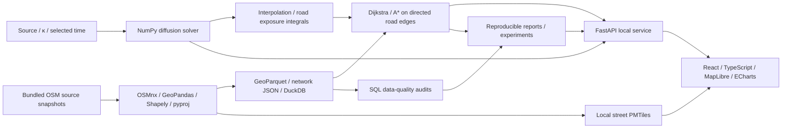

# Flow

**An offline laboratory for diffusion, walking routes, and the cost of avoiding a modeled field.**

Flow asks: **how much extra walking time can reduce exposure to an idealized concentration field?** It connects a numerical PDE solver to a real street network, compares shortest and exposure-aware routes, and makes its assumptions and supporting evidence inspectable.

The study area is a **4 × 4 km rectangle around San Francisco's Mission District**. Roads come from OpenStreetMap; the concentration field is synthetic. This is an interactive mathematical experiment, with no measured pollution or traffic observations.

## What the application does

- Displays a bundled offline street map with local labels, study-area boundaries, a concentration layer, and route overlays.
- Simulates a Gaussian release over 30 minutes and shows 61 frames on a fixed concentration scale.
- Lets you place endpoints and a release source, change the diffusion coefficient, and select Dijkstra or A*.
- Compares distance, walking time, and frozen-field exposure; scans six exposure preferences to show sampled trade-offs.
- Presents numerical checks, data quality, sensitivity analysis, and separate computation timings.
- Saves experiments locally and exports JSON / CSV; stores experiment tables as Parquet for further analysis.

The implementation combines geospatial data preparation, SQL audits, numerical analysis, graph algorithms, and an interactive frontend. The diffusion solver and both path-search algorithms are implemented in the project; NetworkX provides a reference for validation.

## Run locally

Use **Python 3.12**, **Node.js 22.12+**, and npm on macOS or Linux. The bundled dataset includes source snapshots, the processed network, and map assets, so the example requires no geographic-data download or API key.

```bash
git clone https://github.com/roy-pyke/Flow.git
cd Flow
./setup.sh
./start.sh
```

Open **[http://127.0.0.1:8000](http://127.0.0.1:8000)**. On macOS, double-clicking `Start Flow.command` also starts the prepared app. Keep its terminal open and press Ctrl+C to stop. If port 8000 is occupied, use `FLOW_PORT=8001 ./start.sh`.

`setup.sh` needs internet access once: it creates `.venv`, installs pinned Python dependencies and the DuckDB Spatial extension, installs frontend dependencies from the lockfile, and builds the frontend. To select an interpreter, use `FLOW_PYTHON=/path/to/python3.12 ./setup.sh`.

After setup, normal use works offline. `start.sh` binds to `127.0.0.1`; the frontend, PMTiles archive, simulations, routing, and exports are served locally. Labels use system fonts, with no remote glyph or sprite service. The map is generated from road geometries and does not depend on an external tile provider.

### Try an experiment

1. Open the app to load the default Mission District scenario.
2. Choose **Starting point**, **Destination**, or **Release source**, then click inside the study area.
3. Set the diffusion coefficient **κ** and select **Run simulation**.
4. Move or play the timeline to inspect a chosen time.
5. Adjust the exposure preference **λ** and compare the routes. Choose A* or Dijkstra to compare searches.
6. Select **Find the trade-off** to scan λ = 0, 0.5, 1, 2, 5, 10 and inspect the report. Download CSV / JSON, or export the current comparison.

Route endpoints snap to the nearest graph node within 250 m. Routes between different connected components are unreachable. Changing the source or κ requires a new simulation; the UI marks previous results as stale until updated.

## An example result

For the bundled example endpoints, κ = 20 m²/s, and the field frozen at 10 minutes, the [committed preference sweep](reports/tradeoffs.csv) gives:

| Route | Distance | Walking time | Model exposure |
| --- | --- | --- | --- |
| Shortest, λ = 0 | 3.738 km | 44.50 min | 453.003 relative seconds |
| Exposure-aware, λ = 5 | 3.875 km | 46.13 min | 7.711 relative seconds |

In this scenario, about **1.63 additional minutes** reduces the model integral by **98.3%**. The result depends on the source, endpoints, diffusion coefficient, and selected time. It is not a measured reduction in pollution or health risk. Both walks last longer than the selected simulation time because routing deliberately holds that snapshot fixed throughout the walk.


## Mathematical model

### Diffusion

Relative concentration `c(x, y, t)` satisfies the two-dimensional diffusion equation on a rectangular domain Ω:

```text
∂c/∂t = κ ∇²c
∇c · n = 0                       on the boundary of Ω
c(x, y, 0) = exp(-((x-xs)² + (y-ys)²) / (2σ²))
```

`(xs, ys)` is the release location, `n` is the outward boundary normal, `κ` is the diffusion coefficient in m²/s, and `σ = 250 m` is the initial Gaussian width. Concentration is dimensionless, with an initial analytic peak of 1. Computation uses **EPSG:32610** in meters; display and API inputs use longitude and latitude.

| Setting | Current application |
| --- | --- |
| Domain | 4,000 × 4,000 m |
| Grid | 160 × 160 cell centers; 25 m spacing |
| Diffusion coefficient | 5–50 m²/s in the UI; default 20 |
| Duration and output interval | 1,800 s; one frame every 30 s, including time zero |
| Spatial discretization | Conservative finite-volume, five-point stencil |
| Time integration | Explicit Euler with automatically bounded steps |
| Boundary | Reflecting walls: zero normal flux |
| Arithmetic | NumPy `float64` |

Each interior face flux is added to one cell and subtracted from its neighbor, conserving mass in internal transfers. Exterior fluxes are zero. The solver uses

```text
Δt ≤ 0.9 / [2κ(1/Δx² + 1/Δy²)]
```

and shortens a step when needed to land exactly on an output time. For square cells this is `Δt ≤ 0.9 h² / (4κ)`. Values are neither clipped nor renormalized; the displayed scale stays fixed at 0–1 across frames.

### Coupling the field to the road graph

At a selected time `t*`, each directed road edge `e` receives an exposure integral and routing cost:

```text
D_e(t*) = ∫_e c(x, y, t*) ds / v
w_e     = ℓ_e / v + λ D_e(t*)
```

`ℓ_e` is the full road-polyline length in meters, `v = 1.4 m/s` is the constant walking speed, and `λ ≥ 0` is a dimensionless preference weight. `D_e` integrates relative concentration over walking time, reported in **relative seconds**. A path minimizes the sum of `w_e`; λ = 0 recovers shortest distance because walking speed is constant.

Concentration is bilinearly interpolated from cell centers. Trapezoidal integration follows every original polyline segment, preserving vertices and using sample spacing no larger than half a grid cell. Geometry sampling is cached for repeated integrations.

Custom heap-based Dijkstra and A* retain directed parallel-edge identities. A* uses straight-line distance to the destination divided by walking speed. This is an admissible and consistent lower bound because polyline lengths cannot be shorter than straight lines and exposure penalties are nonnegative.

## Architecture and project structure



| Path | Purpose |
| --- | --- |
| `backend/app/diffusion.py` | Grid, conservative updates, simulation, and interpolation |
| `backend/app/routing.py` | Road graph, complete-polyline integration, Dijkstra, and A* |
| `backend/app/validation.py` | Numerical and routing validation helpers |
| `backend/app/main.py` | FastAPI endpoints, caches, persistence, exports, and local assets |
| `frontend/src/` | Interactive map, controls, timeline, route comparison, and charts |
| `configs/region.json` | Geographic center, metric domain, CRS, and walking policy |
| `data/demo/` | Attributed source snapshots, processed road tables, and offline map |
| `data/manifest.json` | Dataset provenance, artifact sizes, and SHA-256 checksums |
| `scripts/` | Repeatable data preparation, quality audits, and experiment generation |
| `reports/` | Scientific evidence in Markdown, JSON, CSV, and PNG |
| `tests/` | Numerical, routing, data-pipeline, region, and API tests |
| `data/experiments/` | Generated local experiment files; excluded from Git |

The frontend uses React, TypeScript, Vite, MapLibre GL JS, PMTiles, and Apache ECharts. Python supplies FastAPI / Uvicorn, NumPy, OSMnx, GeoPandas, Shapely, pyproj, DuckDB Spatial, and PyArrow. Matplotlib generates report figures, NetworkX checks path costs, and pytest exercises correctness. Versions are recorded in `requirements.lock.txt` and `frontend/package-lock.json`.

## Data and reproducibility

The included OSM snapshot has base timestamp **2026-09-17 17:56:05 UTC**. After cleaning, it contains **9,611 nodes and 28,498 directed edges** across **44 connected components**. The largest component contains 9,498 nodes (98.82%). All components are retained.

Every edge preserves its `(u, v, key)` identity and full oriented geometry. Lengths are recomputed in the metric CRS. Roads whose complete geometry leaves the exact analysis rectangle are removed. The graph follows OSMnx's bidirectional walking policy, including on streets that are one-way for motor vehicles.

Compressed original Overpass responses and the downloaded OSMnx graph are included with source metadata and hashes. GeoParquet node and edge tables retain spatial information; `data/demo/network.duckdb` holds materialized copies for SQL analysis. [The data README](data/demo/README.md) explains every dataset and its attribution.

To rebuild from the saved snapshot after setup:

```bash
.venv/bin/python scripts/prepare_region.py
.venv/bin/python scripts/fetch_osm.py
.venv/bin/python scripts/prepare_network.py
.venv/bin/python scripts/prepare_basemap.py
.venv/bin/python scripts/report_data_quality.py
```

`fetch_osm` reuses the existing snapshot. Add `--refresh` only when deliberately downloading a new OSM version; that requires internet access and can change routes and reports. Data-quality generation uses DuckDB Spatial to audit geometry validity, lengths, connectivity, duplicate IDs, and endpoints. For example, with `data/demo/network.duckdb` open:

```sql
LOAD spatial;
SELECT
    count(*) AS directed_edges,
    sum(length_m) AS directed_length_m,
    count(*) FILTER (WHERE NOT ST_IsValid(geometry)) AS invalid_geometries,
    max(abs(length_m - ST_Length(geometry))) AS max_length_error_m
FROM edges;
```

The directed-length total counts each travel direction separately. The map deduplicates physical polylines for display.

Simulation IDs incorporate model parameters, the network-file hash, and a hash of the numerical source. Scenario metadata persists in `data/experiments/`; frames evicted from memory or lost after a restart can be recomputed when the same data and numerical code remain available. Experiments save parameters, data and numerical hashes, Git version, route metrics, and timestamps as JSON / Parquet. Experiment CSV downloads also include provenance fields. Raw field frames are recomputed rather than stored as a persistent frame archive.

## Verification and scientific evidence

Run the checks after setup:

```bash
.venv/bin/python -m pytest -q
npm --prefix frontend run build
npm --prefix frontend run lint
```

GitHub Actions runs the same test, build, and lint stages. To regenerate numerical reports, plots, route sweeps, sensitivity results, and algorithm benchmarks:

```bash
.venv/bin/python -m scripts.run_experiments
```

This rewrites `reports/` and creates local experiments. Timings vary by machine and cache state.

| Evidence | What it establishes |
| --- | --- |
| [Data quality](reports/data_quality.md) | SQL geometry/length audits, graph components, provenance, and interpretation limits |
| [Numerical validation](reports/validation.md) | Constant-state preservation, mass conservation, nonnegativity, and analytic-solution convergence |
| [Analysis](reports/analysis.md) | Preference sweeps, sensitivity to κ and time, NetworkX agreement, and measured timings |

The recorded numerical validation reports maximum relative mass drift of **4.187 × 10⁻¹⁶** and joint refinement orders of **1.9945** and **1.9986** on 32² / 64² / 128² grids. The reference is a decaying cosine solution with zero-flux boundaries. **Euler is first order in time**; the approximately second-order result comes from jointly refining space and time with `Δt = 0.1 h²`.

Both custom searches agree with NetworkX on all six preference settings in the committed analysis, with absolute objective-cost error below `1e-7`. Tests also cover parallel and directed edges, unreachable destinations, identical endpoints, invalid clicks, constant-field polyline integrals, API persistence and exports, and PMTiles byte-range delivery.

Performance reports separate diffusion, road integration, and path-search costs. The first integration includes geometry-sampling preparation; later integrations reuse it. Measurements exclude browser rendering and transport, and are evidence for the recorded environment rather than a performance guarantee.

## Local API and development

The API accepts geographic points as `[longitude, latitude]` and transforms them to metric coordinates internally.

| Endpoint | Purpose |
| --- | --- |
| `GET /api/health` | Service and bundled-data readiness |
| `GET /api/config` | Study area, example points, and dataset version |
| `POST /api/simulations` | Run or reuse a diffusion simulation |
| `GET /api/simulations/{id}/frames/{frame}` | Fetch one concentration frame |
| `POST /api/routes` | Compare shortest and exposure-aware routes |
| `POST /api/experiments` | Run and persist the six-preference sweep |
| `GET /api/experiments` | List persisted experiments |
| `GET /api/experiments/{id}/export?format=json` | Download JSON; use `format=csv` for CSV |
| `GET /api/reports` | Read data-quality, numerical, and analysis evidence |

The machine-readable schema is at `/openapi.json`. For frontend development, keep `./start.sh` running and start `npm --prefix frontend run dev` in a second terminal. Vite proxies `/api` and `/data` to port 8000. After frontend changes, use `npm --prefix frontend run build` to update the app served by `start.sh`.

## Limits and next steps

- **Idealized physics:** no wind, buildings, terrain, chemical reactions, or observational calibration. Reflecting rectangular walls conserve the modeled field but do not represent an open urban atmosphere.
- **Static route exposure:** a walk samples one frozen field. Concentration does not evolve as a traveler moves, and the result is not a pollutant dose or health assessment.
- **Simplified walking model:** constant speed, nearest-node endpoints, and an OSM walking graph. Accessibility and map completeness have not been independently surveyed; this is not a navigation service.
- **Sampled optimization:** six λ values reveal some optimal trade-offs, not a complete Pareto frontier. A* need not outperform Dijkstra for every field or weight.
- **Local scope:** the app targets one bundled study area and a local user. The environment and launcher target macOS / Linux; native Windows execution is not verified.

Further work could compare implicit solvers, add advection and time-dependent exposure, optimize measured bottlenecks, and investigate observation-based calibration. Caltrans PeMS / CWWP traffic ingestion, traffic-flow PDEs, and C++ acceleration are future directions and are not implemented in this release.

## Data attribution

Road and map data © [OpenStreetMap contributors](https://www.openstreetmap.org/copyright). The geographic database and derived map data are provided under the [Open Database License 1.0](https://opendatacommons.org/licenses/odbl/1-0/), with source snapshots and provenance in [data/demo/](data/demo/README.md). No OpenStreetMap standard raster tiles are downloaded or cached.

ODbL applies to the geographic data. The repository currently contains no separate software license for the application source.
