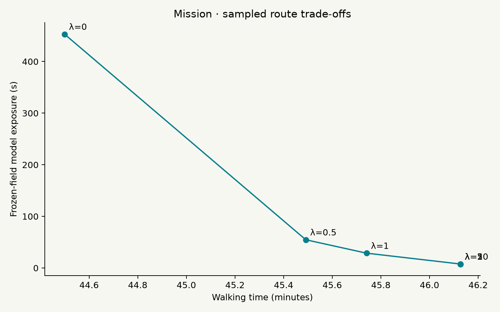
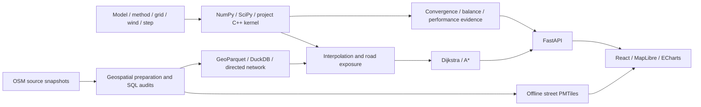

# Flow

**An offline scientific-computing laboratory: diffusion, conservative transport, numerical methods, and walking-route decisions.**

Flow connects a PDE solver to a real street network and asks two questions: **how accurately and efficiently can we compute a concentration field, and when do numerical errors change the route selected from that field?** The application makes methods, assumptions, diagnostics, and reproducible experiments inspectable.

The bundled study area is a **4 × 4 km rectangle around San Francisco's Mission District**. Roads come from OpenStreetMap; concentration and wind are synthetic. This is a mathematical experiment, with no measured pollution or traffic observations.

## What is implemented

- **Five time integrators:** Forward Euler (FE), Backward Euler (BE), Crank–Nicolson (CN), explicit upwind advection–diffusion, and first-order IMEX Euler.
- **Two implementations of diffusion FE:** the original vectorized NumPy stencil and a project-written C++17 kernel whose complete time loop runs natively.
- **Numerical evidence:** separate time/space convergence, matrix structure, mass and energy diagnostics, CN positivity counterexamples, Rannacher startup, transport and open-boundary balance.
- **Performance experiments:** matched NumPy/C++ workloads with raw repetitions and process memory, plus method-level error–time comparisons and cold/warm factorization costs.
- **Field-to-route experiments:** numerical field and edge-exposure errors, and selected routes re-evaluated under a common reference field.
- **Interactive research controls:** method, backend, rectangular grid, step size, wind, boundary, and a saved reference for same-time signed field differences.
- **The original offline app:** local street map, custom Dijkstra/A*, frozen-field route costs, six-preference sweeps, SQL data audits, and JSON/CSV/Parquet experiment records.

A method and its implementation are separate choices: calling SciPy's compiled sparse solver is not presented as a new C++ implicit solver.

## Run locally

Use **Python 3.12**, **Node.js 22.12+**, and npm on macOS or Linux. The bundled dataset includes source snapshots, the processed network, and map assets; no geographic-data download or API key is needed for the example.

```bash
git clone https://github.com/roy-pyke/Flow.git
cd Flow
./setup.sh
./start.sh
```

Open **[http://127.0.0.1:8000](http://127.0.0.1:8000)**. On macOS, `Start Flow.command` also starts the prepared app. Keep its terminal open and press Ctrl+C to stop. If port 8000 is occupied, use `FLOW_PORT=8001 ./start.sh`.

`setup.sh` needs internet access once to create `.venv`, install pinned Python dependencies and DuckDB Spatial, install frontend dependencies from the lockfile, and build the frontend. Select an interpreter with `FLOW_PYTHON=/path/to/python3.12 ./setup.sh`.

After setup, the map, simulation, routing, reports, and exports work offline through a local Python server. Labels use system fonts. **This is a computer-hosted local application; it does not install a standalone offline solver on a phone.**

### Optional native backend

The NumPy/SciPy application works without a compiler. To enable the native FE implementation, install a C++17 toolchain (Xcode Command Line Tools on macOS, or an appropriate compiler on Linux), then run:

```bash
./setup-native.sh
# Equivalent build entry:
.venv/bin/python -m pip install ./cpp
```

The setup script builds the Release extension and runs native parity tests. Restart the server after installing or rebuilding it. The build uses pybind11, scikit-build-core and CMake with pinned Python build dependencies; binaries and build caches are not committed.

`cpp` explicitly requires a usable extension built from the current source. A missing or stale binary produces a clear error. `auto` may choose NumPy when native execution is unavailable and records the actual backend. An error during a chosen computation is not silently hidden by falling back to another implementation.

### Try a method comparison

1. Open the default example: pure diffusion, NumPy FE, 160 × 160 cells, κ = 20 m²/s, zero-flux walls, 30 minutes with 61 output frames.
2. Select **Save current run as reference**.
3. Choose **Crank–Nicolson** or **Backward Euler**, retain the same grid and output times, then **Run simulation**.
4. Choose **Current − reference**. The difference color scale is fixed at the selected ±0.01, ±0.1, or ±1; it is not normalized per frame. The displayed numerical extrema remain unmodified.
5. Change the physical model to **Advection–diffusion**, inspect wind and boundary settings, then run again. Open boundaries track outward mass flux; periodic boundaries are for numerical study.
6. Use **Experiments** to inspect scientific figures and raw data, or run the six-value route preference sweep.

Any solver parameter or source change invalidates the displayed field and routes until rerun. Comparisons require the same grid and an output at the same physical time. Concentration uses a fixed 0–1 scale with a magenta marker for negative values; saturation only affects color. Negative fields remain available for diagnosis and are rejected by routing instead of silently clipped.

Endpoints snap to the nearest graph node within 250 m; different connected components are unreachable. Route costs omit the connector from the clicked point to the snapped node.

## Equations and discretization

The relative concentration obeys

```text
∂c/∂t + ∇·(u c) = κ∇²c
c(x,y,0) = exp(-((x-xs)² + (y-ys)²) / (2σ²)),  σ = 250 m
```

Pure diffusion sets the constant velocity `u = (ux, uy)` to zero. Concentration is dimensionless with an initial analytic peak of 1; κ is in m²/s and wind in m/s. The finite-volume grid is cell-centered and may be rectangular. Computation uses **EPSG:32610** in meters; map display and API point inputs use longitude/latitude.

Each interior diffusive face flux is applied with opposite signs to its neighboring cells. The resulting sparse Laplacian is shared by implicit methods and checked against the direct face-flux operator. Let `L` include κ and let `A` be the conservative first-order upwind advection operator:

| Method | Update | Time order | Backend |
| --- | --- | --- | --- |
| Forward Euler | `c_next = c + dt Lc` | 1 | `numpy`, `cpp`, `auto` |
| Backward Euler | `(I - dt L)c_next = c` | 1 | `scipy` |
| Crank–Nicolson | `(I - dt L/2)c_next = (I + dt L/2)c` | 2 for smooth solutions | `scipy` |
| Explicit transport | `c_next = c + dt(Ac + Lc)` | 1 | `numpy` |
| IMEX Euler | `(I - dt L)c_next = c + dt Ac` | 1 | `numpy_scipy` |

BE/CN/IMEX solve sparse linear systems using SciPy `splu`; they do not form a matrix inverse. Factorizations are reused for equal grid, boundary, κ and actual step size. Steps are shortened to land exactly on output times, with separate factors when necessary. Rannacher startup replaces the first CN macro step with two BE half steps.

For FE, the automatic diffusion step is `0.9 / [2κ(dx⁻² + dy⁻²)]`. The explicit transport bound is `dt[|ux|/dx + |uy|/dy + 2κ(dx⁻² + dy⁻²)] ≤ 0.9`; IMEX retains `dt[|ux|/dx + |uy|/dy] ≤ 0.9`. Requested unstable steps are rejected. Automatic implicit steps are a convenience, not an accuracy guarantee. CN can be linearly stable while producing oscillations and negative concentration at large steps; startup does not promise unconditional positivity.

### Boundary conditions and diagnostics

- **Zero flux:** closed pure-diffusion walls. Constants and total mass are conserved up to floating-point/solve error.
- **Periodic:** opposite faces connect for analytic verification. This is not a realistic city boundary.
- **Open transport:** zero concentration enters through inflow faces; outflow uses the interior upwind concentration with zero diffusive normal flux. Inflow prescribes the total face flux directly rather than adding a second independent diffusion condition.

For open boundaries the check is `M(t) - M(0) + cumulative outward flux ≈ 0`, not constant mass. Diagnostics store both raw change and flux-balance residuals with the declared mass normalization. They also record energy, extrema, actual step counts/sizes, normalized linear residuals, matrix/factorization/advance timings, output memory and backend metadata. Mass, energy and extrema are sampled at the initial state and saved outputs; linear residuals are checked at implicit solves. Values are never clipped or mass-renormalized to make a check pass.

### What the C++ implementation does

The C++17 extension exposes a single-step stencil and complete double-precision FE evolution for zero-flux diffusion. It uses two independent work buffers and releases the GIL during the native loop. It is single-threaded, preserves its input, and avoids Python calls at each time step. It is not a C++ graph solver or a hand-written sparse LU.

The public wrapper explicitly converts inputs to C-contiguous `float64` and records conversion cost; the binding validates shape, dtype and layout. Native provenance includes source/build information so a new source tree cannot silently identify an older binary as the same implementation. Benchmark output separates conversion, allocation, kernel, total call time and process RSS. Output-frame storage is distinguished from working memory.

### From field to road cost

At selected time `t*`, a directed edge `e` receives

```text
D_e(t*) = ∫_e c(x,y,t*) ds / v
w_e     = ℓ_e / v + λ D_e(t*)
```

`ℓ_e` is the complete polyline length, `v = 1.4 m/s`, and λ ≥ 0 is a dimensionless exposure preference. `D_e` is relative concentration integrated over walking time, reported in **relative seconds**. λ = 0 recovers the shortest route.

Bilinear interpolation and trapezoidal integration preserve polyline vertices and sample at no more than half a cell spacing. Custom heap-based Dijkstra and A* preserve directed parallel-edge identities. A* uses straight-line walking time as an admissible lower bound when exposure is nonnegative; NetworkX provides independent optimal-cost checks.

Routes use a **frozen field**, not a PDE that advances with a moving traveler. The numerical sensitivity experiment re-evaluates each candidate path under a common refined field and compares its cost with that reference optimum. A changed path shape alone is not evidence of an incorrect decision.

## The original route experiment

For the bundled example endpoints, κ = 20 m²/s, and the field frozen at 10 minutes, the [committed preference sweep](reports/tradeoffs.csv) gives:

| Route | Distance | Walking time | Model exposure |
| --- | --- | --- | --- |
| Shortest, λ = 0 | 3.738 km | 44.50 min | 453.003 relative seconds |
| Exposure-aware, λ = 5 | 3.875 km | 46.13 min | 7.711 relative seconds |

In this scenario, about **1.63 additional minutes** reduces the model integral by **98.3%**. The result depends on the source, endpoints, diffusion coefficient, and selected time. It is not a measured reduction in pollution or health risk. Both walks last longer than the selected simulation time because routing deliberately holds that snapshot fixed throughout the walk.



## Architecture and source layout



| Path | Purpose |
| --- | --- |
| `backend/app/diffusion.py` | Compatible V1 grid, explicit stencil, Gaussian field and interpolation |
| `backend/app/numerics/` | Sparse operators, method dispatch, time stepping, diagnostics, native wrapper and numerical validation |
| `cpp/` | C++17 stencil/full time loop, strict pybind11 bindings, CMake build and provenance |
| `backend/app/routing.py` | Full-polyline exposure, directed multigraph, Dijkstra and A* |
| `backend/app/main.py` | Validated API, bounded caches, persistence and local assets |
| `frontend/src/` | Map laboratory, method/reference controls, diagnostics and evidence figures |
| `configs/region.json` | Geographic center, metric domain, CRS and walking policy |
| `data/demo/` | Attributed source snapshots, processed network tables and offline map |
| `data/manifest.json` | Provenance, sizes and SHA-256 artifact hashes |
| `scripts/` | Data preparation, SQL audits, experiments and native benchmarks |
| `reports/numerics/` | Numerical methods, raw experiment tables, figures and findings |
| `tests/` | Numerical, native-interface, routing, data and API regression tests |
| `data/experiments/` | Generated local JSON/Parquet records, excluded from Git |

Python uses NumPy, SciPy, FastAPI/Uvicorn, OSMnx, GeoPandas, Shapely, pyproj, DuckDB Spatial and PyArrow. The frontend uses React, TypeScript, Vite, MapLibre, PMTiles and ECharts. Matplotlib produces scientific figures. Runtime versions are pinned in `requirements.lock.txt` and `frontend/package-lock.json`; native build dependencies are in `cpp/pyproject.toml`.

## Data and reproducibility

The included OSM snapshot has base timestamp **2026-09-17 17:56:05 UTC**. After cleaning, it contains **9,611 nodes and 28,498 directed edges** across **44 connected components**. The largest component contains 9,498 nodes (98.82%). All components are retained.

Every edge preserves its `(u, v, key)` identity and full oriented geometry. Lengths are recomputed in the metric CRS. Roads whose complete geometry leaves the exact analysis rectangle are removed. The graph follows OSMnx's bidirectional walking policy, including on streets that are one-way for motor vehicles.

Compressed original Overpass responses and the downloaded OSMnx graph are included with source metadata and hashes. GeoParquet node and edge tables retain spatial information; `data/demo/network.duckdb` holds materialized copies for SQL analysis. [The data README](data/demo/README.md) explains every dataset and its attribution.

To rebuild from the saved snapshot after setup:

```bash
.venv/bin/python scripts/prepare_region.py
.venv/bin/python scripts/fetch_osm.py
.venv/bin/python scripts/prepare_network.py
.venv/bin/python scripts/prepare_basemap.py
.venv/bin/python scripts/report_data_quality.py
```

`fetch_osm` reuses the existing snapshot. Add `--refresh` only when deliberately downloading a new OSM version; that requires internet access and can change routes and reports. Data-quality generation uses DuckDB Spatial to audit geometry validity, lengths, connectivity, duplicate IDs, and endpoints. For example, with `data/demo/network.duckdb` open:

```sql
LOAD spatial;
SELECT
    count(*) AS directed_edges,
    sum(length_m) AS directed_length_m,
    count(*) FILTER (WHERE NOT ST_IsValid(geometry)) AS invalid_geometries,
    max(abs(length_m - ST_Length(geometry))) AS max_length_error_m
FROM edges;
```

The directed-length total counts each travel direction separately. The map deduplicates physical polylines for display.

Simulation identity covers model, method, grid, κ, wind, boundary, step and startup policies, output times, requested/actual backend, dataset hash, numerical-source hash and native build where applicable. Scenario metadata persists in `data/experiments/`; compatible evicted frames can be recomputed. Incompatible old records require a rerun. Experiment JSON/Parquet and CSV exports retain numerical parameters, provenance and route metrics; raw frames are not a persistent archive.

Interactive requests are limited to 320 cells per axis, 121 output frames and 64 MiB of output fields per run, with a separate estimated-work limit. Simulation frames have a 256 MiB cache budget (also at most eight entries); edge-exposure vectors have a 32 MiB budget. Sparse factorizations have their own eight-entry / 256 MiB budget; an oversized factor may be used without being retained. These cache budgets do not cap total process memory or solver peak memory. Larger benchmark grids run through batch scripts.

## Reproduce the scientific evidence

```bash
# Core and application regression checks; native cases skip if uninstalled
.venv/bin/python -m pytest -q
npm --prefix frontend run build
npm --prefix frontend run lint

# Require native code to be available and exercised after building it
FLOW_REQUIRE_NATIVE=1 .venv/bin/python -m pytest -q

# Original geographic, route and diffusion experiments
.venv/bin/python -m scripts.run_experiments

# Matched NumPy/C++ FE benchmarks; requires the native extension
.venv/bin/python -m scripts.benchmark_numerics

# Numerical-method experiments and figures using the saved matching benchmark
.venv/bin/python -m scripts.run_numerical_experiments
```

The CI workflow runs the Python-only tests, builds the C++ extension from source on Linux, requires native tests, and builds/lints the frontend. Local compiler and machine details are retained with benchmark results. Building the extension is distinct from merely importing SciPy's compiled libraries.

| Evidence | Question and interpretation |
| --- | --- |
| [Methods](reports/numerics/methods.md) | Operators, updates, boundary rules and verification references |
| [Validation](reports/numerics/validation.json) | Machine-readable method and structure checks |
| [Time convergence](reports/numerics/temporal_convergence.png) · [CSV](reports/numerics/temporal_convergence.csv) | Fixed spatial grid; are FE/BE first order and CN second order in the declared regime? |
| [Space convergence](reports/numerics/spatial_convergence.png) · [CSV](reports/numerics/spatial_convergence.csv) | Separate spatial error from time integration; diffusion and upwind have different orders |
| [Stability/positivity](reports/numerics/stability_positivity.png) | Large-step CN counterexamples and startup comparisons |
| [Transport balance](reports/numerics/transport_balance.png) | Periodic conservation and open-boundary inflow/outflow accounting |
| [Native benchmark](reports/numerics/benchmark.png) · [CSV](reports/numerics/benchmark.csv) | The same FE workload in NumPy and C++, with repeated samples and memory |
| [Work–precision](reports/numerics/work_precision.png) · [CSV](reports/numerics/work_precision.csv) | Which method reaches a given error most efficiently, including setup and factorization? |
| [Routing sensitivity](reports/numerics/routing_sensitivity.png) | How PDE approximation affects exposure and reference-evaluated path cost |
| [Findings and limitations](reports/numerics/conclusions.md) | What the recorded experiments support, and what they do not |
| [Data quality](reports/data_quality.md) · [Original analysis](reports/analysis.md) | SQL audits, route sweeps, graph-cost checks and the original experiment |

Raw results are authoritative; method names and theoretical orders are not substitutes for measurements. Time convergence uses a fixed spatial operator and an independent reference; space studies control temporal error. CN negativity is an expected diagnostic case rather than a failed claim of linear stability. Route tests and field-error studies are reported separately.

The recorded V2 run passes **111 tests**, including the compiled native backend, and **69** numerical convergence/error-control checks. In the matched 160² / 61-frame benchmark, median NumPy and C++ calls take **21.49 ms** and **10.38 ms** respectively (**2.07×**); these exclude HTTP, browser rendering and shared-dispatch diagnostics. The zero-duration native call is slower because fixed overhead dominates. Full raw measurements, reference uncertainty and limitations are in [the findings](reports/numerics/conclusions.md).

Native timing compares the original vectorized NumPy face-flux stencil with the native FE loop at identical κ, grids, step sequences, outputs and diagnostics. Benchmarks declare warmups, repetitions, thread settings, output policies and per-case wall-time/RSS budgets. Cases exceeding a budget are recorded as unmeasured/aborted, not fabricated successes. Method-level work–precision is a separate comparison: an implicit method taking fewer steps is not counted as C++ implementation speedup. Performance depends on hardware, resolution, output storage and cache state.

## Local API and development

Geographic points are `[longitude, latitude]`; `/openapi.json` contains the full validated schema.

| Endpoint | Purpose |
| --- | --- |
| `GET /api/health` | Local service and bundled-data readiness |
| `GET /api/config` | Defaults, method/backend combinations, native availability and interactive grids |
| `POST /api/simulations` | Run/reuse a complete numerical configuration; return actual parameters and diagnostics |
| `GET /api/simulations/{id}/frames/{frame}` | Fetch the unmodified concentration field |
| `GET /api/simulations/{id}/frames/{frame}?reference_id={other_id}` | Add signed differences at the same grid/domain/time, or reject incompatibility |
| `POST /api/routes` | Shortest and exposure-aware paths in a nonnegative frozen field |
| `POST /api/experiments` | Persist a six-preference route sweep |
| `GET /api/experiments` | List persisted local experiments |
| `GET /api/experiments/{id}/export?format=json` | JSON export; use `format=csv` for CSV |
| `GET /api/reports` | Geographic, original analysis and numerical-study reports |

For development, start the backend with `./start.sh` and run `npm --prefix frontend run dev` in another terminal. Rebuild with `npm --prefix frontend run build` to update the production assets served locally. Rebuild/restart the native extension after editing C++ sources.

## Limits and next steps

- **Idealized physics:** constant κ and constant wind, a smooth synthetic Gaussian source, no buildings, terrain, reactions or observational calibration. Open and periodic edges are explicitly chosen mathematical models.
- **First-order transport:** upwind introduces numerical diffusion; IMEX Euler is first order even though pure-diffusion CN is second order. Higher-order transport is not implemented.
- **Restricted native scope:** the C++ backend implements zero-flux FE diffusion. Implicit methods use SciPy sparse LU; the native loop is single-threaded and does not implement graph search.
- **Static exposure:** no time-dependent route optimization, real pollutant dose, health model or traffic flow. Some walks outlast the field timestamp because it is frozen.
- **Simplified street model:** constant walking speed, nearest-node endpoints, no surveyed accessibility or guarantee of current closures. Six preferences sample trade-offs rather than a full Pareto frontier.
- **Study and platform scope:** one bundled geographic region, one local user, macOS/Linux launchers. Native Windows execution, standalone phone/offline-PWA operation and outdoor navigation are not verified.
- **Performance limits:** sparse LU fill-in and stored outputs can dominate memory at larger grids. Cache budgets do not replace per-experiment resource budgets.

Further scientific work can build on these results: variable/anisotropic diffusion, higher-order conservative transport, preconditioned iterative solvers, a second measured C++ kernel for exposure integration, or time-dependent paths. New physical claims would require suitable observational data and validation.

## Data attribution

Road and map data © [OpenStreetMap contributors](https://www.openstreetmap.org/copyright). The geographic database and derived map data are provided under the [Open Database License 1.0](https://opendatacommons.org/licenses/odbl/1-0/), with source snapshots and provenance in [data/demo/](data/demo/README.md). No OpenStreetMap standard raster tiles are downloaded or cached.

ODbL applies to the geographic data. The repository currently contains no separate software license for the application source.
