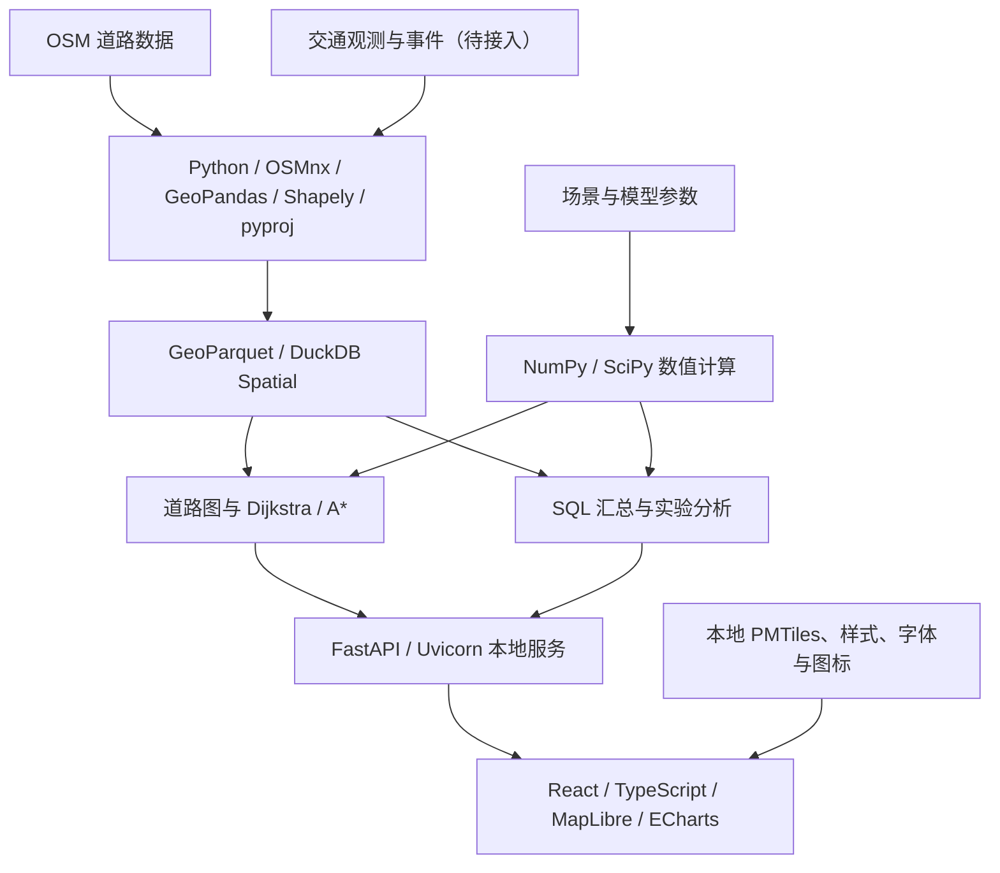

# Flow

本地地图与计算分析项目，将数据工程、图算法、数据分析和 PDE 数值计算连接到可交互的地图中，用于学习、实验和求职作品展示。

## 当前状态

项目处于规划阶段，目前仓库包含方案文档，尚无应用代码、依赖清单或可运行的 demo。下文中的技术栈是计划选型，不代表已经安装或接入。

- [第一版开发计划与一周排期](PLAN_1.md)：二维扩散场、步行路网与路线权衡实验。
- 交通方向扩展：评估 Caltrans 等官方数据，探索真实交通回放、拥堵分析和单走廊交通流模型；数据权限、路段覆盖和质量仍需验证。
- 运行形式：浏览器访问本机服务。联网时获取数据，数据与资源准备完成后支持本地计算和离线回放。

## 核心技术栈

以下为首版共享的基础技术栈，扩散实验与后续交通分析可以复用。

| 层次 | 技术 | 在项目中的用途 |
| --- | --- | --- |
| 页面与交互 | **React + TypeScript** | 地图页面、参数表单、图层开关、时间轴和结果面板 |
| 前端构建 | **Vite** | 开发服务、资源处理与生产构建 |
| 地图渲染 | **MapLibre GL JS** | 底图、道路、路线、事件和数值结果图层 |
| 离线底图 | **PMTiles + Protomaps 地图资源** | 保存区域底图，并配套本地样式、字体字形和图标资源 |
| 分析图表 | **Apache ECharts** | 路线权衡、时间序列、误差收敛和性能对比 |
| 后端语言 | **Python 3.12** | 数据采集、清洗、算法、数值实验与接口服务 |
| 本地 API | **FastAPI + Uvicorn** | 连接前端与计算模块，提供本地资源和结果导出 |
| 路网获取 | **OSMnx** | 获取 OpenStreetMap 道路数据，构建、整理和保存路网 |
| 空间数据处理 | **GeoPandas** | 节点和道路几何表、空间数据读写与处理 |
| 几何计算 | **Shapely** | 几何检查、区域裁剪、道路折线采样与空间关系计算 |
| 坐标转换 | **pyproj** | 经纬度与米制投影之间的转换，统一距离和计算网格的单位 |
| 本地分析引擎 | **DuckDB + Spatial 扩展** | 使用 SQL 查询道路与实验数据，执行空间分析和质量汇总 |
| 空间数据存储 | **GeoParquet** | 持久化清洗后的节点、道路边及其几何和坐标系信息 |
| 数组计算 | **NumPy** | 网格与场数据、向量化离散计算、统计量和误差计算 |
| 科学计算 | **SciPy** | 插值、数值工具，以及后续隐式方法需要的稀疏线性代数 |
| 图算法对照 | **NetworkX** | 图数据结构与参考算法，核对自主实现的最优路径成本 |
| 自动化验证 | **pytest** | 数据处理、图算法、数值方法及接口的正确性检查 |
| 开发工具 | **Node.js + npm、Python 虚拟环境、Git + GitHub** | 前端工具链、Python 环境隔离、代码与文档版本管理 |

Python 版本为计划基线；其他库的具体版本将在初始化应用时记录到依赖清单与锁定文件中。浏览器端流程检查工具尚未选定。

## 数据来源与接入状态

地图显示资源、可计算的道路拓扑和交通观测数据分别准备。PMTiles 用于显示，路径计算使用独立构建的道路图。

| 数据来源 | 数据用途 | 当前接入状态 |
| --- | --- | --- |
| **OpenStreetMap / OSMnx** | 道路几何、连接关系、方向和道路属性 | 计划作为路网基础；尚未下载项目数据 |
| **Protomaps** | 可在本机使用的区域底图及配套资源 | 计划采用；尚未准备离线资源包 |
| **Caltrans PeMS** | 高速检测器数据、速度、流量、占有率与历史分析 | 已完成官方资料调研；账户内权限、自动化获取方式和实际延迟待验证 |
| **Caltrans CWWP** | 封道、电子路牌、道路天气及部分路段旅行时间 | 调研时已读取部分公开文件；尚未接入项目，需逐个检查时间戳、坐标和单位 |
| **湾区 511** | 事故、施工、封路和绕行事件 | 备选来源，需要 API token；尚未接入 |
| **WSDOT** | 华盛顿州拥堵状态、指定路线旅行时间和道路警报 | 备选来源，需要 Access Code；尚未接入 |

参考入口：[OSMnx](https://osmnx.readthedocs.io/en/stable/getting-started.html)、[Protomaps 下载](https://docs.protomaps.com/basemaps/downloads)、[PeMS](https://dot.ca.gov/programs/traffic-operations/mpr/pems-source)、[CWWP](https://cwwp2.dot.ca.gov/)、[511](https://511.org/open-data/traffic)、[WSDOT](https://www.wsdot.wa.gov/traffic/api/)。

交通数据处理将记录观测时间、获取时间、来源和质量标记。能访问文件不代表数据仍在更新；未覆盖路段、过期记录和填补值需要明确区分。

## 图算法与数学方法

### 第一版：扩散与路径权衡

| 模块 | 计划采用的方法 | 验证重点 |
| --- | --- | --- |
| 基础路径搜索 | 自主实现 **Dijkstra 和 A\***；NetworkX 作参考 | 最优成本一致性、启发式下界、平行边与不可达情况 |
| 连续模型 | **二维热方程 / 扩散方程**，高斯形初值、零通量边界 | 模型假设、边界含义与质量守恒 |
| 空间离散 | **单元中心网格与保守五点离散** | 离散算子、边界处理和网格误差 |
| 时间推进 | **显式 Euler**，按扩散稳定性条件控制时间步长 | 稳定性、非负性和时间精度 |
| 场与路网耦合 | **双线性插值 + 沿道路弧长的梯形积分** | 采样间距、积分单位与常量场对照 |
| 路线目标 | 步行时间与模型暴露积分的加权成本 | 固定时刻的场、固定浓度尺度和非负边权 |
| 数值分析 | 解析解对照、网格加密、误差范数与收敛阶 | 区分空间精度、时间精度和联合收敛结果 |
| 数据分析 | 参数扫描、敏感性分析与性能基准 | 固定数据和参数，保存可复现的实验结果 |

具体模型、默认参数和验收标准见 [PLAN_1.md](PLAN_1.md)。第一版使用冻结时刻的理想化扩散场，不将结果表述为真实污染预测或动态暴露预测。

### 待验证的交通扩展

- **LWR 交通流守恒模型**：围绕一条高速走廊研究拥堵形成、传播与消散。
- **Godunov 有限体积方法**：作为交通流 PDE 的候选数值方法，检查守恒、CFL 条件、激波与解析解。
- **观测对照与参数估计**：在确认 PeMS 数据覆盖和质量后，比较模型与历史观测；传感器占有率不能直接视为车辆密度。
- **事件与路线分析**：将可验证的封路事件匹配到路网，分析连通性、可达性和绕行变化。

交通模型参考：[Clawpack LWR 教材](https://www.clawpack.org/riemann_book/html/Traffic_flow.html)。这一扩展尚未替代初版扩散方案，也尚未实现。

## 数据流与模块关系

## 本地运行与结果保存设计

- 服务监听 `127.0.0.1`；发布后的前端构建产物、地图资源和 API 由本地服务提供。
- 联网准备阶段获取依赖和数据；离线阶段读取快照、回放历史、计算路线并运行数值实验。断网时不获取新的实时观测。
- 原始数据按来源保留快照；清洗后的空间数据使用 GeoParquet，实验指标使用 Parquet，前端小规模几何结果使用 GeoJSON。
- 每次实验记录数据版本、模型参数、网格、时间步长、代码版本和耗时，以便重复比较。
- 地图的样式、字体字形、图标和前端资源均需本地化；DuckDB Spatial 扩展在离线运行前准备好。
- 数据服务凭据保存在本机环境配置中，不写入前端或提交到仓库；地图保留数据来源署名。

离线资源参考：[PMTiles 与 MapLibre](https://docs.protomaps.com/pmtiles/maplibre)、[本地字体与图标](https://docs.protomaps.com/basemaps/maplibre)、[DuckDB Spatial](https://duckdb.org/docs/current/core_extensions/spatial/overview)。

## 后续技术选项

这些选项不属于首版必须安装的依赖。

| 选项 | 引入时机 |
| --- | --- |
| **C++ 计算模块** | 性能测量发现明确瓶颈后，用于对比实现、加速和内存分析；与 Python 的绑定方式届时确定 |
| **隐式时间推进与 SciPy 稀疏求解器** | 比较显式与隐式方法的精度、稳定性和计算代价时 |
| **对流扩散模型** | 基础扩散求解和验证完成后，增加输运机制 |
| **Tauri 桌面封装** | 本地网页稳定且需要安装包时；当前优先交付本地网页 |

## 验证与开发入口

计划覆盖数据质量检查、图算法对照、数值守恒与收敛测试、性能实验，以及清空浏览器缓存后的断网端到端检查。目前这些检查均待实现。

开发周期和逐日交付目标见 [第一版开发计划](PLAN_1.md)。仓库尚未初始化应用，因此暂不提供安装或启动命令；完成依赖配置与启动流程验证后再补充。
