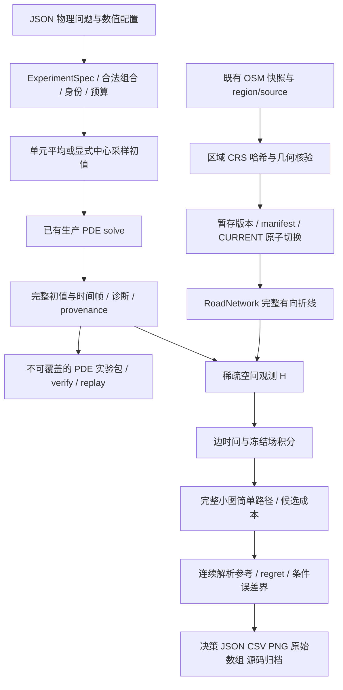

# Flow Research 第一阶段完整实现档案

> GitHub 公开副本：按用户要求于 2026-10-02 发布。正文记录该批交付时的状态；“未推送”等历史表述不代表当前分支状态。代码链接已改为仓库相对路径；本地验收日志、内部规划记录仍以文件名标识。

本文把第一阶段的目标、实施、文件设计、数学约定、验证结果、复现方法和未完成边界放在同一个文件中。它是一份阶段回溯档案，不是整个 Research 项目的完成声明。

第一阶段在用户时区 **2026-10-01，America/Los_Angeles** 完成；部分机器记录使用 UTC，因而显示为 2026-10-02。项目目录为 `/path/to/Flow-Research`，原项目为 `/path/to/Flow`。

## 1. 本文的历史边界和证据来源

| 项目 | 第一阶段固定值 |
|---|---|
| 起始基线 | `9ffd5fdbafaf4d3b8c231719f8c09ffe8fb2c3bd` |
| 第一阶段终点 | `420ac772dccbd3c3f047303e70f835f954bcecc8` |
| 分支 | `codex/research-v3` |
| 提交说明 | `Add reproducible research experiments and sparse road observations` |
| Git 变更规模 | 57 个跟踪路径，9,489 行增加、175 行删除；统计包含归档源码和长 JSON 报告 |
| 首批已验收清单 | 28 / 186 项必做；另有 158 项必做、12 项可选尚未验收 |
| 已交付能力 | 可配置 PDE → 原始数组归档 → 道路空间积分 → 小图路径比较 → 参考 regret → 本地重放 |

**代码描述以 `git show 420ac77:<path>` 为准，差异以 `git diff 9ffd5fd 420ac77` 为准。** 当前工作区后来增加的时变旅程积分、等待、时间展开搜索等第二阶段功能，不计入本档案；尤其不能把第二阶段提交 `001a4b85118a641934b67d19eac096d4c08942e8` 的实现倒算给第一阶段。

事实来源按用途分开：

1. IMPLEMENTATION_PHASE1.json（本地记录 `planning/IMPLEMENTATION_PHASE1.json`） 是第一阶段完成数量、提交、检查结果、重放和隔离核验的机器记录。
2. 05_IMPLEMENTATION_PROGRESS.zh-CN.md（本地记录 `planning/05_IMPLEMENTATION_PROGRESS.zh-CN.md`） 是首批交付时的解释、运行方法和未验收项说明。
3. BASELINE_VERIFICATION.json（本地记录 `planning/BASELINE_VERIFICATION.json`） 保存原始 V2 状态、120 个跟踪文件记录及规划阶段的已知问题。该文件中“新环境未安装”描述的是实施前状态，不能覆盖第一阶段已经完成安装的后续记录。
4. `planning/validation/` 的日志支持原生构建、217 项测试和真实网络重建；正式科学证据位于 [decision_baseline](../../reports/research/decision_baseline/REPORT.zh-CN.md) 和 [observation_baseline](../../reports/research/observation_baseline/README.md)。
5. Git 中的阶段源码和正式报告是可追溯实现；本地运行环境、规划文件及较大生成物另列，不能混称为这 57 个提交路径。

本文整理时没有重新跑测试、PDE 实验或性能测量。下文的运行数字均来自第一阶段已保存证据；文档核验只检查历史代码、文件清单、链接及归档字节。

## 2. 为什么先做这一阶段

项目的长期研究目标是：**在有限计算预算下，可靠比较扩散与输运模型产生的路径决策，解释数值误差何时会改变决策，并将计算投入真正影响结论的部分。** 使用对象是学生和研究者。

第一阶段针对一个具体科研痛点：场图看起来相近、普通场误差看起来小，并不足以说明路径选择可靠。若没有统一问题定义、同一张图、同一目标函数、独立参考和可重放记录，就难以分辨“模型变了”“离散误差变了”“道路积分变了”和“恰好处于两条路径的交点附近”。

为此先完成一个范围明确的闭环：常系数扩散或恒定风输运问题可以离开地图单独运行；冻结场通过明确的空间重构和求积变成边暴露；有向小图的完整简单路径集合提供可核验比较对象；所选路径统一回到参考成本中计算 regret；配置、数组、路径和前提随实验保存。

第一阶段没有引入真实污染观测、空气质量校准、健康风险模型、连续时间动态全局优化，也没有替换已有全部数值方法。浓度仍是合成的相对量；“relative-concentration seconds”是模型积分单位，不是实际吸入剂量。

## 3. 独立目录、环境和原项目保护

### 3.1 起点与隔离方式

新项目从固定 V2 提交建立独立 checkout，使用自己的 `codex/research-v3` 分支和 `.venv`。原项目继续位于 `Flow`，实施文件和新证据均放在 `Flow-Research`。

实施前 V2 已核验 111 项测试、前端构建和 lint。规划记录比较了 120 个跟踪文件：Git 内容全部等价；其中 11 个历史 CSV 在新 checkout 中因既有 `*.csv text eol=lf` 规则发生换行正规化，因此初始磁盘字节完全一致为 109 个，不能把这一现象误称为算法改动。第一阶段结束时的独立核验记录是：**原 Flow 的 120 个跟踪文件仍与之前记录逐字节一致，原 Git 工作区 clean。**

### 3.2 实际搭建和验证

- `./setup.sh` 为新目录安装 Python 和前端依赖，并构建前端。环境记录为 Python 3.12.6、Node v22.18.0、npm 10.9.3。
- `./setup-native.sh` 在新环境构建既有 C++17/pybind11 扩展 `flow-cpp==0.2.0`。保存的 wheel 名为 `flow_cpp-0.2.0-cp312-cp312-macosx_26_0_arm64.whl`；该脚本当时的原生校验为 29 passed / 0.50 s。
- 第一阶段**没有新增 C++ PDE 内核实现**。构建原生扩展是环境独立性与现有后端回归的一部分；新增性能工作主要是 SciPy CSR 道路观测算子及批处理。
- 全套检查使用 `FLOW_REQUIRE_NATIVE=1`，防止缺少原生模块时靠跳过测试获得通过状态。
- 新目录曾在临时 8012 端口真实启动：首页 HTTP 200、health 为 `ok` 且 `data_ready=true`；检查后停止服务。日常 `./start.sh` 的默认端口仍为 8000。
- 没有公开推送、远程部署、购买计算资源或联系外部使用者。第一阶段完成记录明确为本地提交与本机证据。

证据文件：setup.txt（本地记录 `planning/validation/setup.txt`）、native-setup.txt（本地记录 `planning/validation/native-setup.txt`）、pytest.txt（本地记录 `planning/validation/pytest.txt`）、IMPLEMENTATION_PHASE1.json（本地记录 `planning/IMPLEMENTATION_PHASE1.json`）。

## 4. 架构与数据流



这张图表示研究能力的组合关系。它不表示第一阶段已经把新数据集切换接入地图 UI：**现有 Web API/UI 仍读取 `data/demo`。** 新版数据发布器提供可独立解析的研究数据目录，研究配置通过 Python/CLI 使用。

设计上的职责划分是：`problems.py` 定义问题与约束；既有 `numerics/solver.py` 执行 PDE；`observations.py` 定义“给定场和指定路径怎样积分”；`routing.py` 搜索静态图；`decision.py` 评价候选选择与误差前提；`experiments.py` 保存与重放。没有让道路选择函数兼任 PDE 配置解析器，也没有把参考真值藏进普通路径搜索。

## 5. 物理问题、离散配置与身份

### 5.1 `backend/app/research/problems.py`

这是新增的研究问题入口，主要 API 为 `ExperimentSpec`、`load_spec`、`initial_field`、`check_budget`、`capabilities`。此前没有与地图接口分离的版本化研究配置；现在纯矩形域无需 OSM 就能运行。

| 对象 | 内容和约定 |
|---|---|
| `StrictSpec` | 禁止未知字段，拒绝 NaN/Inf，验证默认值，配置对象冻结；不应将它误读为所有 Python 数字类型都采用完全无转换解析 |
| `ProblemSpec` | 矩形 bounds、`diffusion`/`advection_diffusion`、常数 κ、常风 velocity、边界、初值；坐标米、时间秒、相对浓度 |
| `NumericalSpec` | nx/ny、严格递增非负输出时刻、方法、后端、dt、startup、`cell_average`/`point_sample` |
| `BudgetSpec` | 输出字节和估计 cell updates 的预检查预算 |
| `ExperimentSpec` | schema version 1；检查物理模型与方法、后端、边界、启动方式、输入网格之间的组合关系 |

兼容性约束包括：纯扩散速度为零，只接受 zero-flux 或 periodic；带输运模型使用 periodic/open；周期 cosine 的半波模式数必须为偶数；C++ 后端只支持已有 zero-flux Forward Euler；Rannacher startup 只适用于 Crank–Nicolson。CFL 的最终执行约束仍由生产 solver 检查。`capabilities()` 枚举当前合法组合，并单独报告支持的初值类型与系数范围。

第一阶段支持四类初值：

- `constant`：常量数组。
- `gaussian`：中心、σ、幅值、背景；默认通过可分离 erf 积分取得真正的单元平均。
- `cosine`：两个方向模式、幅值和背景；默认单元平均为中心 cosine 乘各方向的 sinc 因子。
- `npz`：唯一数组键为 `values`；声明 SHA-256、bounds、nx/ny、`y,x`、south-to-north、单位及是 cell average 还是 point sample。

单元平均与中心点样本刻意区分。对一维 cosine，平均因子为

\[
\frac{1}{h}\int_{x_i-h/2}^{x_i+h/2}\cos(kx)\,dx
=\cos(kx_i)\operatorname{sinc}\!\left(\frac{kh}{2\pi}\right),
\]

其中 NumPy 的 `sinc(z)=sin(πz)/(πz)`。二维使用两个方向因子的乘积。Gaussian 使用单元两端的 erf 差；独立求积测试核对其结果。用户显式选择 `point_sample` 时才采用中心采样；制造解除错路案例独立声明其中心模态约定，不能与默认 FV 单元平均暗中混用。

NPZ 导入核对压缩文件和解压内容预算、hash、唯一键、实数 dtype、有限性和精确形状；`allow_pickle=False`。输入的域、网格和 interpretation 必须与实验一致，不暗中重采样、翻转 y 轴或改单位。配置声明错误可拒绝；代码并不能凭数组本身识别一个形状恰好相同但被用户错误标注的物理场。

### 5.2 三种身份

`physical_id` 哈希物理描述；`numerical_id` 哈希方法、网格、时间采样等数值描述；`configuration_id` 哈希 schema 加物理和数值描述。字典使用排序后的 canonical JSON 和 SHA-256。

对解析初值，同一物理问题改网格只改变数值身份；改 κ、边界或初值参数改变物理身份。对导入数组，内容 hash、原始网格和 interpretation 本身属于输入描述，因此换一份重采样输入并不自动保持同一个物理身份。NPZ 的本机文件路径从物理身份中排除，文件搬进归档后内容身份保持一致。执行预算不进入科学配置身份，它控制能否接纳本次计算。

### 5.3 预算不是资源隔离

默认输出预算为 128 MiB，默认更新预算为 500,000,000 cell updates。`check_budget()` 在求解前估计 `nx×ny×输出帧数×8` 和由 dt/CFL/输出对齐推得的步数，并为输出对齐与启动保留余量。

它是保守的接纳检查，**不限制进程 RSS、稀疏 LU 峰值、操作系统调度或总 wall time**，也不是可恢复任务调度器。首阶段文档、测试和结果中的 `budget_kind` 均保留这个边界。

## 6. 空间重构、稀疏 H 与轨迹

### 6.1 `backend/app/diffusion.py`：边界正确的共享权重

PDE 时间推进没有在本文件中改写。变化集中于新增 `bilinear_weights(grid, points, boundary)`，并让 `bilinear_interpolate` 使用这组共享权重。

以前插值把所有采样都按非周期壁面截断处理，周期 PDE 在左右接缝可得到不同值。规划阶段复现：8×8 网格的 `1+0.5 sin(2πx)` 在 x=0/1 的采样分别约为 1.19134/0.808658，而解析接缝均为 1。现在 periodic 在索引层把最后与第一个 cell centre 相连；zero-flux 和 open 对外侧半格采用最近中心值的常量延伸。

open 的常量延伸是**空间观测约定**，不等于 PDE 的入流边界条件。越过物理域的点仍拒绝，不进行任意域外外推或把几何路线瞬移到周期另一侧。只容许约 `32×float64_eps×坐标尺度` 的坐标舍入误差。四个权重非负且和为 1，索引采用 C 顺序 `y,x` 展平；网格边、角点和矩形非等距网格都有用例。

### 6.2 `backend/app/observations.py`：算子定义

`build_edge_observer(network, grid, boundary='zero_flux', speed_mps=1.4, quadrature='trapezoid', sample_spacing_m=None)` 生成 `EdgeObserver`，包含 CSR `matrix`、grid 与 metadata。`apply(field)` 输入 `(ny,nx)` 输出每条有向边的积分；`apply_batch(fields, chunk_size=None)` 输入 `(batch,ny,nx)` 输出 `(batch,edge)`。

设重构在求积点 q 上为 `R(c)(x_q)=Σ_j b_qj c_j`，距离求积权重为 `w_q`，步速为 v，则

\[
H_{ej}=\sum_{q\in e}\frac{w_q}{v}b_{qj},\qquad
E_e^h=(Hc)_e,\qquad H\mathbf1=\left(\frac{\ell_e}{v}\right)_e.
\]

这一定义保留原始折线的全部顶点；边界权重和求积权重非负，所以 `H≥0`。`H·1` 等于每条边的旅行时间，是核心结构检查。矩阵 COO 合并重复项后转 CSR、去零并排序；数据/indices/indptr 缓冲区设为只读。构造权重或乘法结果溢出为非有限值时拒绝。

H 对给定重构是线性的，因此基础线性代数接口允许 signed finite fields，便于之后研究转置、差值和伴随。路由调用另行要求浓度非负，任何负值均拒绝；没有把负浓度裁剪后悄悄送给非负成本搜索。**单元平均数据进入 H 后只代表所选重构的积分，不能因此声称真实连续场在这些位置恰好等于中心值。**

metadata 保存 typed `(u,v,key)`、几何 hash、grid、边界、速度、求积方式、步距、重构版本、算子身份、采样数、nnz、CSR 字节及构造时间。整型 key `1` 和字符串 key `"1"` 的身份不会合并。

### 6.3 两种求积与两种误差

默认 `trapezoid` 保留 V2 的逐折线段复合梯形规则，最大步距为 `grid.h/2`；同一重构、同一规则下与旧向量化插值聚合数值一致。

`gauss2_grid` 先在每条线段穿过的 x/y cell-centre 重构节点处切分。双线性多项式限制到一条直线上是至多二次多项式，每个分段使用两点 Gauss，因此对**该双线性重构**的积分仅剩浮点舍入误差。Gauss 点不包含端点，所以实现先单独检查每个原始线段端点，防止越界短段被内部节点漏掉。这个参考不是连续 PDE 真值。

基准额外保存两条独立曲线：固定 16×16 场 `1+x*y`、只细化梯形步距，研究求积误差；固定 `gauss2_grid`、对 `1+x²+y²` 改网格 8/16/32/64，研究重构误差。不能把两种细化造成的改善合成一个不明来源的“精度”。

### 6.4 `backend/app/routing.py`：重复应用和缓存

以前 `edge_exposures` 每次重新插值、乘权重再 `bincount`；现在取得对应 H 后矩阵乘法，保持旧默认积分语义并新增 boundary/quadrature/spacing 参数。

观测缓存采用 LRU，最多 8 项且保留的 CSR 字节不超过 64 MiB；采样点缓存独立为最多 8 项、32 MiB。超预算对象可本次使用但不保留。缓存 key 覆盖 bounds、nx/ny、速度、边界、求积及步距；网络几何假定在 `RoadNetwork` 生命周期内固定，换数据或改几何要构建新对象，不能直接修改内部字典后期待旧缓存自动识别。

这些限制只管缓存保留量。构造 H 所需临时数组、批处理完整输出和 SciPy 的工作空间不在此预算中；`chunk_size` 限制分块计算，不意味着最终结果数组不需要内存。

### 6.5 第一阶段的 `PathTrajectory`

`build_path_trajectory(network, edge_indices, speed_mps, departure_time_s)` 将已经指定的连通有向边序列转换为折线顶点和累计旅行时刻；`positions(times_s)` 返回时刻对应的位置。它独立于 A*/Dijkstra，也保留重复边与回环的全部旅行时间。

第一阶段要求非空有效边序列、正速度、有限出发时刻、真实几何在共享端点处精确相接；零长度重复顶点被跳过，不能新增未经计时的短连接段。时间查询必须在出发至到达区间内。此时没有等待费用、没有时空场积分，也没有动态搜索；后来针对动态搜索终点对齐的实现不属于首批成果。地图点击吸附到图节点的离网连接段仍不计入路径成本。

## 7. 静态路径 oracle 与条件决策界

### 7.1 `backend/app/research/decision.py` 的 API

`enumerate_simple_paths` 在有界小图枚举顶点不重复的有向简单路径，默认最多 12 个节点、10,000 条路径。平行边按完整身份保留；自环与重复节点不属于此可行集；起终点相同返回空路径；不可达返回完整的空集合。预算不足直接报错，不把截断集合标为完整。

`SimplePathSet` 保存 start/end、边序列、graph hash 与 candidate hash；图 hash 覆盖 CRS、bounds、节点坐标和边几何/身份。`path_costs` 求边成本之和；`minimizers` 按显式绝对容差保存所有同成本最优索引。生产 A*/Dijkstra 在独立小图中与穷举最优成本核对，路线 ID 不同但成本并列不判为错误。

`integral_error_bound`、`candidate_bounds`、`static_graph_interval_bound` 负责条件判断。证据类型 `assumed`、`analytic_manufactured` 和 `empirical` 进入输出；经验估计标记 `empirical_only`，不会自动升级为严格认证。

### 7.2 固定路径 sup 误差界

同一条路径、同一时间参数化下，若沿全路径都有 `|c−ĉ|≤ε_c`，旅行时长为 T，则

\[
|E(P)-\widehat E(P)|\le T\epsilon_c,
\qquad |J(P)-\widehat J(P)|\le\lambda T\epsilon_c.
\]

这里 `J=T+λE`、λ≥0。普通体域 L2 误差不提供无条件线积分上界；只知道网格节点的最大误差也不够。重构和求积误差必须另计。

### 7.3 有限集合的 `2ε+η`

对于同一个有限候选集 C，所有候选均满足 `|J_i−Ĵ_i|≤ε`；算法选中的 s 满足 `Ĵ_s≤min_i Ĵ_i+η`。令参考最优为 i*，则

\[
J_s-J_{i^*}
\le (\widehat J_s+\epsilon)-(\widehat J_{i^*}-\epsilon)
\le 2\epsilon+\eta.
\]

实现要求每个候选都有界，并检查给出的 η 不小于已知有限集合上的实际近似搜索 gap。只提供所选路径的误差界不能认证整个集合。这个结论只对已声明 C 成立；若 C 未覆盖全图，不能称为全图或连续问题最优性证明。

### 7.4 异质区间、共享误差与静态图

不同路径可有不同 ε_i，构造 `L_i=Ĵ_i−ε_i`、`U_i=Ĵ_i+ε_i`。所选路径的 regret 有界为 `max(0,U_s−min_i L_i)`；若 `U_s<min_{i≠s}L_i`，区间严格分离是所选路径最优的充分条件。

若可独立证明路径差值误差 `|(J_s−J_i)−(Ĵ_s−Ĵ_i)|≤δ_si`，`candidate_bounds` 还接受直接差值界。共享误差可能在差值中抵消；测试中两个成本都偏移 +5，但差值误差为 0。接口不会只凭“相关”一词自行推断抵消量。

对固定静态有向图，边真成本满足 `[l_e,u_e]` 时，用下界图最短路 `d_l(s,t)` 得到

\[
\operatorname{regret}(P)\le\sum_{e\in P}u_e-d_l(s,t).
\]

若知道真成本非负，可将负下界收紧到 0；否则有负下界时拒绝交给 Dijkstra，需要其他算法。上界若与非负先验矛盾也拒绝。非负静态成本的最优 walk 可以取成简单路径，因此这个图下界的范围比有限候选界大；该论证不适用于时变费用或随到达时间变化的状态。

全部界仍依赖模型一致、候选一致、误差前提有效。第一阶段用 float64 核验，没有向外舍入区间算术、形式化证明或未知真解的自动有效误差估计器。

## 8. 五个真正运行过的 PDE 决策实验

`configs/research/decision_study.json` 声明一个 1000×1000 m 的矩形、κ=20 m²/s、速度 1.4 m/s、均值 1、幅值 0.95、y 方向第一 cosine 模态及 zero-flux 边界。生产 Backward Euler/scipy 实际推进初值；从未为了路径结果改动或裁剪原始场。

共同图起点在 `(100,500)`，终点 `(900,500)`；路径 0 经过 y=800 的上走廊，长度 1400 m；路径 1 经过 y=350 的下走廊，长度 1100 m。每条路线都在同一个 snapshot 的冻结场上积分，目标均为 `J=T+λE`。

连续参考为

\[
c(y,t)=1+0.95\,e^{-\kappa k^2t}\cos(ky),\qquad k=\pi/1000.
\]

另一层参考是同一网格的精确半离散 cosine 模态，特征值 `μ_h=−4κ/dy²·sin²(k dy/2)`。所以“生产解相对精确半离散解”记录时间离散误差，“精确半离散解相对连续节点值”记录空间离散误差；连续场沿每条直线段的积分用 cosine/sinc 解析公式独立计算。

| 案例 | n×n | snapshot / dt（s） | λ | 选择 / 参考最优 | 节点 Linf | 参考 regret（s） |
|---|---:|---:|---:|---|---:|---:|
| `large_error_same_route` | 8×8 | 3000 / 3000 | 0.2 | 1 / [1] | 0.0726294036 | 0 |
| `small_error_wrong_route` | 32×32 | 1000 / 10 | 0.4018821119 | 1 / [0] | 0.0002747947 | 0.0595756470 |
| `reference_tie` | 8×8 | 1000 / 100 | 0.4017704118 | 1 / [0,1] | 0.0033712288 | 0 |
| `reference_near_tie` | 8×8 | 1000 / 100 | 0.4017704158 | 1 / [0] | 0.0033712288 | 0.000002142857 |
| `positive_regret` | 8×8 | 3000 / 3000 | 0.6724234496 | 0 / [1] | 0.0726294036 | 19.6240238680 |

大误差案例的误差比小误差案例大约 264 倍，但前者选对、后者选错。这支持“不能仅以场误差大小代替决策分析”，并不说明这里的较粗离散更好。真并列案例保留两个最优项，不因挑了其中一条而制造 regret。

λ 的构造完全记录：`fixed` 是预设值；`reference_tie` 是解析参考两条成本线的交点；`reference_near_tie` 在参考交点乘 `1+1e-8`；`threshold_midpoint` 取数值交点和参考交点中点，主动进入选择不一致区间。**这些是反例构造，没有进行城市失败率抽样或独立留出验证。**

制造解的完整积分误差界由三项组成：节点误差；连续 cosine 到双线性/壁面常量重构的 `dy²·sup|c_yy|/8`；每段平滑解析场梯形余项 `段旅行时间×段步距²×sup|d²c/ds²|/12`。非负权重将前两项按旅行时间传播到边积分，再累加为路径成本界。

五个案例的静态图 regret 上界分别约为 26.10245、0.849191、11.89526、11.89526、112.19436 s，均覆盖实际 regret，但明显保守。完整链保存在每个 case 的 `field_error`、`edge_error_bounds`、`paths`、`candidate_certificate`、`static_graph_certificate` 中；不只保存一张好看的场图。

## 9. 归档、完整性和重放的三种格式

### 9.1 `backend/app/research/experiments.py`：通用 PDE 包

关键 API 为 `run_experiment`、`verify_bundle`、`replay_bundle`、`provenance`。`scripts/run_research.py` 把它们提供为 `run`、`verify`、`replay`、`capabilities` 子命令。此前只有现有地图实验的局部结果；现在可保存独立研究问题完整帧。

标准目录包含 `config.json`、`result.json`、`fields.npz`、`manifest.json`；若初值来自 NPZ，再加入 `initial_input.npz`。`fields.npz` 必须且仅含 `initial`、`times_s`、`frames`。result 保存三种身份、grid、初始化语义、solver 诊断、预算估计、完整源码 hash/provenance 和执行耗时。

发布时先写同级暂存目录，完成文件 fsync、manifest 和自校验后才 rename 成目标目录，目标已存在则拒绝。NPZ 输入复制进包且配置路径改为 `initial_input.npz`，不依赖原机器绝对路径。失败清理暂存目录，不留下一个看似完成的包。

`verify_bundle` 检查 schema/status、必需文件、路径安全、无符号链接、字节数/hash、无额外未列文件、result/config 身份、数组键/维度/时刻/有限性和展开大小。导入输入必须位于 manifest 内，并且其值与实际归档初值一致。

一个重要修复是：解析初值归档的 **verify 不再用当前数学库重新计算公式并要求逐位相同**。文件完整性、schema 和有限性是一件事；今天的库重新求解是否相符是 replay 的另一件事。`replay_bundle` 使用当前实现重算，返回原始帧的 Linf/RMS 差，不承诺跨 OS/库版本逐位一致。

### 9.2 决策包：独立 schema 与源码快照

`scripts/run_decision_experiments.py` 自己保存 decision schema：config、network、report、paths CSV、PNG、35 个原始数组、中文报告、源码快照和依赖锁。manifest 的键为 `files`，每项有 `sha256` 和 `bytes`；覆盖除 manifest 自身之外的 26 个文件。它与通用 PDE 包的 `artifacts`/`size_bytes` schema 不同，**不能把 decision 目录传给 `scripts.run_research verify`**。

源码快照包含 19 个文件：backend 的当时 Python 源码、决策 runner、scripts 包标记和 requirements 锁文件。它有意保存实际实验当时的源代码；报告内 git revision/dirty 状态来自提交前运行，不能在提交完成后回写成新 SHA 伪造“当时已经提交”。终点记录另外核验源码快照与首阶段最终工作树匹配。

归档是可检查字节的本地包，不是签名、沙箱或数学真实性证明；依赖锁也不自动重建操作系统。35 数组的本机逐位重放支持可复算性，但不承诺别的机器逐位相等。

### 9.3 Git 字节保真

CSV 写入时的 CRLF 与 Git 的文本换行规则可能让“磁盘 hash 正确”的包在提交/checkout 后失配。因此 `.gitattributes` 增加 `reports/research/** -text`，并为归档 CSV 设置相应 whitespace 属性。首阶段核验过 26 个 manifest 文件在磁盘和 Git 归档中的字节一致。

`.gitignore` 则新增 `/data/datasets/`、`/data/sources/`，把可重新生成的大型版本目录留在本地。正式精简证据保存在跟踪的 `reports/research/`。规划文件的排除来自本地 `.git/info/exclude`，不是这次共享 `.gitignore` 新增的规则。

## 10. OSM 数据生成器与原子发布

### 10.1 `scripts/prepare_region.py`

以前生成流程可隐式修改固定 demo 区域文件；现在 `prepare_region(config)` 作为纯计算/验证函数返回区域，CLI 只有指定 `--output` 才写独立 preview JSON。

验证 region_id、有限经纬度、正尺寸、buffer、正步速、walk 网络，以及两个轴单位都为米的投影 CRS。宽高最多 100 km，buffer 也有界；用 `always_xy` 与变换错误检查生成研究域、地理域和下载 polygon。不能用地理度数或英尺 CRS 假装米。

### 10.2 `scripts/dataset_io.py`

新增 `validate_source`、`resolve_dataset_dir`、`publish_dataset`、`copy_source`、流式 `sha256`。

`validate_source` 在生成器写输出前核对保存区域、分析 CRS、来源 CRS 声明、中心/宽高/buffer/网络类型、完整查询 polygon、分析 bounds、每个快照的字节数和 SHA-256。缺失或不兼容即拒绝。第一阶段**不支持子区域复用**，没有在缺少覆盖判据时偷偷接受。

发布结构为 `根目录/CURRENT.json` 加 `versions/<32位hex>/`。build 回调先完成所有文件及科学结构核验，发布器写版本 manifest、同步文件与目录、把 staging rename 成完整 generation，最后原子替换 CURRENT 指针。指针保存版本和 manifest hash；读取方一次解析、默认核验全部产物，然后在整个操作中固定该 generation。

失败发生在指针替换前，旧版本继续可读；替换之后最多暴露完整新版本。旧版本和已经完整但未被指针引用的 orphan 版本保留，避免破坏已有读取者。并发写入为 last-writer-wins，不是事务合并。第一次发布失败后有 `versions` 但无 CURRENT 的目录，不会误认成旧式平铺数据集。旧式非版本目录只作为读取输入，拒绝发布进去。

这里的原子可见性基于同文件系统 rename，fsync 请求本地文件系统的持久化；回归用例模拟写入和指针失败，没有声称跨网络文件系统或真实断电均已验证。

### 10.3 `scripts/fetch_osm.py`

`fetch(config, refresh=False, source_dir=..., output_dir=..., raw_dir=...)` 不再覆盖 demo。已有输出 CURRENT 时优先复用该输出来源，避免再次运行退回更老 bundled source。复用先核验；首次复用可以发布新的 source generation。显式 `--refresh` 才重新获取 OSM。

每次下载使用独立 raw cache；在 finally 中恢复 OSMnx 的缓存、日志、timeout 设置。拒绝空图或错误 CRS；保存 GraphML、压缩原始 Overpass 响应、获取时间、OSM 时间戳、许可/来源和快照 hash。下载或序列化失败不覆盖已经发布的来源。

第一阶段实际重建使用现有快照，没有把“实现 refresh”写成“重新下载了当前城市数据”。

### 10.4 `scripts/prepare_network.py`

`prepare_network(..., source_dir=..., output_dir=..., endpoint_tolerance_m=0.1)` 在源核验后加载非空有向 MultiDiGraph、检查 graph CRS，再投影。

清洗检查包括：有限节点坐标、域内节点、完整二维 LineString、正且有限长度、整条折线不越域、方向反转后两端分别匹配、孤立点和空结果。坏端点直接剔除，不靠移动节点掩盖误差。保留所有连通分量与全部平行有向边；仅显示 GeoJSON 可以按等价几何去重。结果记录源图和 provenance hash、剔除数量及政策。

staging 内同时写 region/source/raw snapshots、`network.json`、`roads.geojson`、`nodes.parquet`、`edges.parquet`；两张 GeoParquet 回读核对数量、CRS、geometry，且再核验来源后才发布，避免新 JSON 搭配旧或残缺 Parquet。

实际 Mission 重建得到 **9,611 节点、28,498 有向边、14,247 条显示折线、44 个弱连通分量**。已保存版本为 `data/datasets/mission-rebuilt/versions/4600c68aa4a04e4e9b296deeb977cc30`。

**这一生成链没有新建 PMTiles，也没有生成新版 DuckDB 分析/报告包。** `prepare_basemap.py` 和 `report_data_quality.py` 仍属于旧 demo 流程；新 generator 的输出不会自动让 UI 切到新版本。README 已移除容易混淆的旧串行重建指令，改为单独研究数据发布示例并写明限制。

## 11. 现有 API 的接入与失败语义

`backend/app/main.py` 的首批改动没有重做前端，而是保证旧 API 使用新观测语义：

1. `get_exposures` 把模拟中的 boundary 传给 `RoadNetwork.edge_exposures`，避免 periodic PDE 仍按 zero-flux 采样。
2. `numerical_version()` 把 `observations.py` 纳入实现 hash，使观测代码变化不会遗漏在数值身份之外。
3. `route_json(route, network)` 增加 nodes、edge_indices、edge_ids。边 key 以字符串加 `key_type` 保留类型，原有 cost/time/exposure/GeoJSON 继续输出。路径 sweep 不再只留成本而丢失路线身份。
4. 实验 export 先生成临时 Parquet，完成后替换伴随文件，最后才发布 JSON 主记录。异常清理临时和目标 Parquet，防止列表出现没有完整 companion 的实验。

这是 JSON 发布顺序与 companion 完整性的改进，不等于旧 API 实验格式已经统一为新的 PDE bundle。点击吸附与节点之间的短连接段、跨版本数据集自动切换、丰富研究配置的 UI 表单均尚未加入。

## 12. 文件层面设计：非归档新增/修改文件

下表将每个非归档实现文件的职责与改前/改后集中对应。数学与失败约定见上文相应章节；完整 57 路径附录也包含所有报告和源码快照。

| 文件 | 核心接口或内容 | 改前 → 改后 / 设计约束 |
|---|---|---|
| `.gitattributes` | research 归档字节策略 | 自动文本正规化 → 科学包保留原字节，避免 hash 经 Git 失效 |
| `.gitignore` | datasets/sources 忽略 | 新生成版本会进入未跟踪列表 → 大生成物不混入源码提交 |
| `README.md` | 项目入口、架构、数据命令 | Flow V2 首页 → Research 扩展入口；历史结果保留范围，链接研究指南并明示 PMTiles/UI 边界 |
| `backend/app/diffusion.py` | `bilinear_weights`、`bilinear_interpolate` | 统一壁面截断 → 共享凸权重和显式边界采样；PDE 推进未改写 |
| `backend/app/observations.py` | `EdgeObserver`、`build_edge_observer`、`PathTrajectory` | 无独立观测模块 → 稀疏空间积分、Gauss 参考、指定轨迹；第一阶段不积分时变场 |
| `backend/app/routing.py` | `edge_exposures`、两类 LRU | 每场直接聚合 → 缓存 H 重复应用；严格非负路由；预算只管保留量 |
| `backend/app/main.py` | boundary 传播、typed 路径导出、写入顺序 | 观测边界丢失/路径身份不足/先 JSON → 语义传播、完整身份、Parquet 成功后 JSON |
| `backend/app/research/__init__.py` | 包标记 | 新的空包入口，不隐式执行实验 |
| `backend/app/research/problems.py` | 版本化 schema、初始化、身份、预算、能力表 | 地图参数主导 → 独立矩形物理问题；拒绝不支持组合和隐式输入变换 |
| `backend/app/research/experiments.py` | run/verify/replay/provenance | 无完整独立 PDE 包 → 不可覆盖归档、完整数组、输入自包含、校验与重算分离 |
| `backend/app/research/decision.py` | 完整小图 oracle、候选界、图界 | 无此研究比较模块 → 可核验前提和 regret；不冒称一般动态全局认证 |
| `configs/research/cosine_diffusion.json` | 2×1.5 m、40×32、κ=.07、CN/scipy | 新配置示例；时间 `[0,.125,.25,.5]`，dt=.0078125，真实 cell average |
| `configs/research/decision_study.json` | 五案例固定构造协议 | 新反例集配置；每案例网格、snapshot、dt、λ 政策均显式保存 |
| `scripts/run_research.py` | 四个 CLI 子命令 | 新自动化入口；支持直接脚本和模块调用，失败返回明确 CLI 错误 |
| `scripts/run_decision_experiments.py` | validate/run/write_bundle、JSON/CSV/PNG | 新科学脚本；连续/半离散参考、共同成本、无修改原场、完整源码归档 |
| `scripts/benchmark_observations.py` | frozen V2 baseline、benchmark、render_plot、`--replot` | 新匹配工作负载实验；构造/应用分开，绘图不强制重测 |
| `scripts/dataset_io.py` | validate/resolve/publish/copy/hash | 新共享版本层；先整包完成后指针切换，保留旧 reader 可见版本 |
| `scripts/prepare_region.py` | `prepare_region`、显式输出 CLI | 隐式固定区域写入 → 配置验证和独立 preview |
| `scripts/fetch_osm.py` | `fetch`、独立 acquisition cache | 固定快照流程 → 验证复用、受控 refresh、版本发布、失败保留旧来源 |
| `scripts/prepare_network.py` | `prepare_network` | 来源/几何约束不足且固定目录 → 双端点和 roundtrip 核验后发布独立版本 |
| `tests/test_observations.py` | H/重构/缓存/轨迹结构用例 | 新非负、分片统一、独立解析积分、边角接缝、越界、overflow 与 repeated-edge 检查 |
| `tests/test_decision_study.py` | oracle/bounds/制造解/bundle | 新独立答案与统计不变量；完整集合/eta 前提、同成本、正 regret、hash/重放检查 |
| `tests/test_research_experiments.py` | schema/初值/预算/归档/导入 | 新身份区分、独立 Gaussian 求积、NPZ 自包含、篡改与未知版本拒绝 |
| `tests/test_pipeline_generation.py` | 离线 graph fixture、故障注入 | 过去偏成品检查 → 直接运行生成器；坏源、几何、序列化与 pointer 失败不发布半包 |
| `tests/test_api_research.py` | FastAPI TestClient | 新 periodic 传播、路径 key 类型、成功 companion 和写失败无实验记录检查 |
| `docs/research.md` | 英文研究操作指南 | 新建能力/前提/复现/数据/性能说明，不把 CLI 功能说成已有新 UI |

## 13. 验证结果及它们能证明什么

| 验证 | 已保存结果 | 证据与范围 |
|---|---|---|
| 原 V2 基线 | 111 passed / 5.37 s，前端 build/lint 通过 | 实施前基线记录；不是第一阶段新代码数量 |
| 新环境原生构建 | flow-cpp 0.2.0 安装；29 passed / 0.50 s | `validation/native-setup.txt` |
| 第一阶段全套 | **217 passed，2 warnings，5.58 s** | `validation/pytest.txt`；`FLOW_REQUIRE_NATIVE=1`；相对基线总用例计数增加 106，不等于 106 个独立测试函数 |
| 前端 | production build、lint 通过 | 阶段 JSON；仍有既有 >500 kB chunk 提醒，未解决前端拆包问题 |
| Git 文本检查 | `git diff --check` 通过 | 阶段 JSON；不是数学验证 |
| 应用 smoke | index=200，health=ok/data_ready | 阶段 JSON 和本地 smoke 记录；验证后停服 |
| 真实图重建 | 9,611 / 28,498，44 分量 | `validation/network-rebuild.txt`；有完整版本 manifest |
| cosine PDE replay | 原始帧 Linf=0、RMS=0 | `cosine-final` → `cosine-final-replay`；本机当前环境结果 |
| decision 源码 replay | **35 个数组逐位一致**；科学记录除耗时外一致 | 阶段 JSON；本地 `output/research-validation/decision-replay/` |
| decision 归档 | 26 个文件按 manifest 校验；Git 归档字节校验通过 | 正式 manifest、`.gitattributes`、阶段 JSON |
| 原目录保护 | 原 120 个跟踪文件未变且 Git clean | 阶段 JSON；与基线文件记录对照 |

两条 warning 是 FastAPI/Starlette 测试栈相关弃用提醒，不是测试失败。阶段重放排除了 `build_ms`、`solve_ms`、`timings_ms`、`total_case_ms` 等不应稳定的计时字段；不能要求重算具有相同 wall time。

五个新测试文件覆盖的重点不是“实现调用一次就通过”，而是独立可手算/解析答案、旧实现等价性、结构不变量、完整可行集 oracle 和故障注入。旧 PDE/原生/API 等回归仍在 217 项中一起执行。

本阶段没有新 Linux CI 通过记录，没有重跑旧 V2 全部 `reports/numerics/` 生成流程，也没有外部研究者独立使用的完成证据。

## 14. 性能结果、冷成本与精度分解

正式保存的观测基准使用 Mission 的 28,498 条有向边、160×160 网格、25 m 格距、12.5 m 梯形采样、速度 1.4 m/s、同一组非负生成场。先验证两种输出相符，再做 2 次预热与 7 次交替次序计时；原始每次毫秒数完整保存在 JSON。

比较基线是冻结的 **V2 直接 zero-flux 插值表达式加 NumPy bincount**，并且已缓存采样点，不用新增共享 stencil 的额外开销人为拖慢基线。两种计时都包括输入验证和输出分配；图解析、造场、H/采样构造、PDE、搜索、HTTP 和前端不计入应用比值。

| 批量场数 | V2 应用中位数（ms） | H 应用中位数（ms） | 应用比值 | 最大绝对差 | V2 准备+应用估计（ms） | H 准备+应用估计（ms） |
|---:|---:|---:|---:|---:|---:|---:|
| 1 | 5.209292 | 0.239542 | **21.75×** | 1.7053e-13 | 11.1010 | 78.0051 |
| 8 | 41.005583 | 1.102708 | **37.19×** | 2.2737e-13 | 46.8973 | 78.8683 |
| 32 | 164.430208 | 4.120167 | **39.91×** | 3.4106e-13 | 170.3219 | 81.8857 |

构造与内存事实：采样准备 5.891708 ms；测量 H 构造 71.873834 ms；完整 H 准备为 77.765542 ms，因为本次 H 重用了已准备样本。图加载 462.064709 ms、32 场生成 5.130042 ms 单列。H 为 28,498×25,600，217,604 个非零项，CSR 存储 **2,725,244 bytes**；采样数组 6,014,144 bytes，187,942 个求积点。

单场只调用一次时，包含准备后 H 更慢。用“增量构造耗时 / 单次中位节约”估计，单场重复约 14.46 次，即约 15 次后才摊平这次构造；8 场批次约 1.80 次，32 场批次约 0.45 次。这里是一次构造测量加中位应用的分项估计，**不是反复冷启动测量或保证所有机器均有这个临界点**。若样本超缓存上限，H 构造内已重新造样本，脚本避免重复把这部分计入 cold setup。

精度方面，历史 V2 与当前普通插值在此次全部采样比较中的最大差为 0；两条空间积分路径最大差为 3.4106e-13 relative-concentration seconds。独立解析 `1+x*y` 折线积分为 1.1579534560244793，分段 Gauss 为 1.1579534560244795，差 2.22e-16。

固定重构的梯形误差随步距 .2/.1/.05/.025/.0125 降为约 `1.1744e-3 / 3.6784e-4 / 9.1959e-5 / 2.4301e-5 / 6.2416e-6`；固定精确重构积分的网格误差随 n=8/16/32/64 降为约 `4.1289e-3 / 1.0081e-3 / 2.5329e-4 / 6.3699e-5`。这些曲线使用中心样本，不能冒称为 FV 单元平均的独立收敛证明。

基准环境保存为 macOS 26.5.2 arm64、Python 3.12.6、NumPy 2.5.3、SciPy 1.18.1、Pydantic 2.13.5；单 Python 进程，没有显式并行 worker。没有由此宣布整个应用、PDE 或动态搜索快了 40 倍。

正式图的坐标刻度曾修正，但没有重跑计时。`measurement_source.py` 保存原测量脚本，其 SHA-256 对应原 JSON 的 `benchmark_script_sha256`；当前 `benchmark_observations.py --replot` 只读 JSON 重画 PNG，不修改测量值。

## 15. 本批发现并修复的具体问题

以下修复可由第一阶段代码差异和回归用例确认；不把后续阶段的问题混入。

| 问题 | 第一阶段处理 | 核验依据 |
|---|---|---|
| 周期 PDE 接缝仍按非周期插值 | 新 `bilinear_weights` 按 periodic 连接首尾中心 | Fourier 接缝、角点、常量权重测试；API boundary 传播 |
| 每帧重复插值与聚合 | 预构造 H，批量 CSR 应用，明确同规则比较 | 独立 V2 对照、H·1、非负性和基准 |
| Gauss 内部采样可能漏掉越界端点 | 构造前检查全部原始线段端点 | 越界 Gauss endpoint 回归 |
| 极小速度/巨大权重导致非有限结果 | 构造与 apply 后都检查 finite | overflow 输入用例 |
| 缓存无明确保留上限 | 两个 LRU 的项数与字节预算、超限不保留 | 淘汰和 oversized-object 测试 |
| 微小负浓度仍可能进入非负路由 | 路由拒绝任何负值；线性 H 仍允许 signed 输入 | 负值不裁剪用例 |
| 指定轨迹可拼接不一致端点 | 共享几何必须精确相接，不虚构免费 connector | 轨迹几何/计时/重复边用例 |
| 全集合界只拿所选路径误差或虚报搜索 gap | 每候选一项界，检查 eta；预算穷举拒绝伪完整 | certificate 与 oracle 负面用例 |
| 负下界直接用于 Dijkstra | 有非负先验才收紧，否则拒绝 | 图界与完整 oracle 对照 |
| 初值导入依赖包外文件或配置与输入不一致 | 入包复制、manifest 强绑定、精确输入值比较 | external-path、missing-archive、hash/value mismatch 用例 |
| 完整性检查受今天的解析库舍入影响 | verify 不重算解析公式，replay 独立重算 | monkeypatch 数学初值构造的回归 |
| 未知 result schema 即使 hash 更新也可能被误读 | 验证 result schema version | unknown-result-schema 用例 |
| 生成器先动旧文件，失败留下混合世代 | source 预检查、整包 staging、版本指针最后切换 | Parquet/下载/序列化/pointer 故障注入 |
| 反转几何后只管一端、以移动端点掩盖错误 | 反向后核验两端，剔除坏边；保留平行边 | 离线 MultiDiGraph 生成器用例 |
| 第一次发布失败的目录被当成 legacy | 有 versions 无 CURRENT 时明确拒绝 | unpublished-first-generation 用例 |
| API 先写 JSON 后 Parquet | companion 成功后发布 JSON，失败清理 | Parquet failure 无实验列表记录 |
| Git 正规化 CSV 导致 hash 变化 | research 包禁用文本正规化 | 26 文件 Git 归档字节核验 |
| 把新插值 helper 当旧性能基线、遗漏冷成本 | 冻结 V2 表达式；准备与应用单列；避免双算采样 | 原始 benchmark、measurement_source、cold/amortization 字段 |
| 图刻度可读性不足且重绘不该重测 | 独立 `render_plot`/`--replot` | 保留原计时 JSON 与原测量源码 |

## 16. 第一阶段验收的 28 项任务

这是 `IMPLEMENTATION_PHASE1.json.done_task_ids` 的精确历史列表。当前总清单可能已经加入第二阶段状态，因此不能从今天的勾选总数回推第一阶段。28/186 是任务数，不代表 15% 的工程工作量或研究价值已完成。

| 任务 | 首阶段验收内容 | 主要证据 |
|---|---|---|
| M00-02 | 新目录独立环境、原生扩展、回归和前端检查 | setup/native/pytest 日志、阶段 JSON |
| M00-03 | 固定 V2 提交、依赖、数据和旧证据 | BASELINE_VERIFICATION、原目录 120 文件核验 |
| M00-04 | 可机读方法能力矩阵与 unsupported 拒绝 | `capabilities`、`ExperimentSpec`、schema 测试 |
| M00-10 | 阶段配置/版本/验证/缺口记录 | phase1 JSON 与进度文档 |
| M01-01 | 周期插值接缝修复 | `bilinear_weights` 与观测测试 |
| M01-03 | 区域/CRS/快照/hash 预核验 | `validate_source`、坏来源用例 |
| M01-04 | fetch 写入顺序与旧来源保护 | fetch 失败/复用/refresh 用例 |
| M01-05 | 数据集整包原子发布 | `publish_dataset`、pointer/Parquet 失败用例 |
| M01-06 | 完整图几何验证 | `prepare_network`、端点/平行/空图/越界用例 |
| M01-07 | 直接测试生成器 | 离线 MultiDiGraph fixture 与故障注入 |
| M01-08 | 物理与数值配置身份分离 | 三类 hash、身份测试 |
| M02-03 | 安全数组初值导入 | NPZ/schema/hash/轴/shape/禁止 pickle |
| M02-13 | 纯矩形研究域 | cosine PDE 与人工图，不依赖 OSM |
| M05-01 | 指定轨迹与选路分离 | `PathTrajectory`，不含后续时变积分 |
| M05-02 | 稀疏冻结场 H | V2 同规则 parity、稳定边身份 |
| M05-03 | H 非负及 H·1=旅行时间 | 结构不变量测试 |
| M05-04 | 重构上的高精度积分参考 | `gauss2_grid`、独立解析积分 |
| M05-05 | 求积误差和场重构误差分开 | benchmark 两条独立曲线 |
| M05-13 | 观测缓存身份与保留预算 | 两类 LRU、metadata、淘汰测试 |
| M06-04 | 小图完整简单路径 oracle | 平行边/回环/不可达/预算与搜索对照 |
| M06-12 | 同成本最优与负值场规则 | `minimizers`、真并列案例、严格负值拒绝 |
| M07-05 | sup→积分与 λTε | 积分界、重构与求积修正、制造解核验 |
| M07-06 | 有限集合 2ε+η | 全候选前提与 eta 检查 |
| M07-07 | 异质区间与直接差值界 | 区间分离、共享误差抵消用例 |
| M07-08 | 静态非负下界图 regret 界 | Dijkstra 下界图与穷举核对 |
| M07-15 | 误差和决策反例集 | 五个实际 PDE 案例 |
| M10-09 | 稀疏批量积分与构造/应用成本 | 1/8/32 场基准、chunk API、cold 数据 |
| M12-07 | 场→边→路径差→决策→regret 证据链 | 决策 JSON/CSV/原始数组与图 |

## 17. 第一阶段未完成或仅部分完成的工作

仍有 158 项必做和 12 项可选尚未在这一阶段验收。具体包括：

- 完整 R1–R5 研究协议、留出场景、统一证据类型和系统误差账本。
- 变系数扩散、时变面速度、体源、多峰/紧支撑初值与新的统一研究 UI。
- 高阶守恒输运、matrix-free PCG、多重网格、严格 work-precision 对比和新的 CPU 并行内核。
- 时变场沿旅程积分、时间覆盖、等待、动态到达反例、时间展开参考搜索及连续时间误差分析。首阶段只有空间 H 与指定轨迹。
- 一般大图的多样候选生成、候选遗漏误差、预算搜索 gap、时变全局最优性。
- 未知真解下的目标误差估计器、伴随/敏感度、残差恒等式、自适应计算、不确定性传播和校准。
- 通用空间细化参考自身收敛核验；制造解已有连续/半离散参考不等于所有问题都有可靠参考。
- 构造期峰值内存限制、大矩阵回退、全情景内存预算、任务中断恢复与统一历史包导入。
- 新 PMTiles/DuckDB 版本包、UI 数据集切换和完整导出格式统一。
- 新 Linux CI、全部旧报告复算、真实输入研究、独立外部研究者复现和实际使用验证。

因此 M00-01/05/08、M01-02/09/10/11/12、M02-01/02、M05-12/14、M06-02/03/06/13、M07-02/04/16、M11-01/05/06/07/09/10 等即使有部分接口或材料，也没有因为“有一些代码”就提前整项勾选。阶段二、三后来完成的部分应在各自档案单独验收。

## 18. 运行、校验和重放命令

以下是可执行操作指南，不表示编写本文时又运行了这些命令。所有新实验输出目录必须不存在；重复运行时换新名字。默认从新项目目录操作。

```bash
cd /path/to/Flow-Research
./start.sh
```

日常 UI 为 `http://127.0.0.1:8000`。丰富研究配置仍使用 CLI/Python。

### 18.1 通用 PDE 实验

```bash
.venv/bin/python -m scripts.run_research capabilities
.venv/bin/python -m scripts.run_research run configs/research/cosine_diffusion.json --output data/experiments/research/my-cosine
.venv/bin/python -m scripts.run_research verify data/experiments/research/my-cosine
.venv/bin/python -m scripts.run_research replay data/experiments/research/my-cosine --output data/experiments/research/my-cosine-replay
```

这会使用当前 checkout；若要审计第一阶段源码，应读取固定提交或使用归档源文件，不把当前更高阶段的 capabilities 当作首阶段能力。

### 18.2 新决策案例包与历史源码重放

```bash
.venv/bin/python -m scripts.run_decision_experiments --config configs/research/decision_study.json --output reports/research/my-decision-study
```

重放第一阶段正式包的源码时，使用准备好的解释器并禁写字节码，避免 Python 在已归档源目录添加 `__pycache__`：

```bash
cd /path/to/Flow-Research/reports/research/decision_baseline/source_snapshot
/path/to/Flow-Research/.venv/bin/python -B -m scripts.run_decision_experiments --config ../config.json --output /path/to/Flow-Research/output/research-validation/my-phase1-decision-replay
```

这重用当前已安装依赖，不自动安装锁定环境。输出的日期/耗时/provenance 可以变化，科学数组和结论应另行比较。

decision 包没有通用 PDE verify 子命令；下面只核对正式包的 manifest 字节与文件集合，不运行科学实验：

```bash
cd /path/to/Flow-Research
.venv/bin/python -B - <<'PY'
from pathlib import Path, PurePosixPath
import hashlib, json
root = Path('reports/research/decision_baseline')
m = json.loads((root / 'manifest.json').read_text())
assert m['schema_version'] == 1
for name, meta in m['files'].items():
    rel = PurePosixPath(name)
    assert not rel.is_absolute() and '..' not in rel.parts and '\\' not in name
    p = root / name
    assert p.is_file() and not p.is_symlink()
    data = p.read_bytes()
    assert len(data) == meta['bytes']
    assert hashlib.sha256(data).hexdigest() == meta['sha256']
actual = {str(p.relative_to(root)) for p in root.rglob('*') if p.is_file()}
assert actual == set(m['files']) | {'manifest.json'}
print(f"Verified {len(m['files'])} files; integrity only, not scientific accuracy.")
PY
```

如要比较一次新的历史源码重放，使用原始 NPZ 的每个键做数组对照，而非要求整个 JSON 字节相同：

```bash
.venv/bin/python -B - <<'PY'
from pathlib import Path
import numpy as np
root = Path('/path/to/Flow-Research')
a = root / 'reports/research/decision_baseline/raw_fields.npz'
b = root / 'output/research-validation/my-phase1-decision-replay/raw_fields.npz'
with np.load(a, allow_pickle=False) as old, np.load(b, allow_pickle=False) as new:
    assert set(old.files) == set(new.files)
    for key in old.files:
        np.testing.assert_array_equal(old[key], new[key])
    print(len(old.files), 'arrays are bitwise equal in this environment')
PY
```

逐位不等时应报告最大误差并调查依赖/实现差异，而非删除不匹配证据或把浮点近似称为逐位相同。第一阶段保存的结果是上述 35 数组在当时本机环境中逐位相同。

### 18.3 性能测量或只重绘

```bash
.venv/bin/python -m scripts.benchmark_observations --output reports/research/my-observation-study
.venv/bin/python scripts/benchmark_observations.py --replot reports/research/observation_baseline/benchmark.json
```

第一条产生新测量，第二条只替换保存 JSON 同目录中的 PNG；它不是只读文件操作，但不重跑计时。原正式计时 JSON 与 `measurement_source.py` 应保留。

### 18.4 独立研究数据集

```bash
.venv/bin/python scripts/prepare_region.py --output output/region-preview.json
.venv/bin/python scripts/prepare_network.py --source-dir data/demo --output-dir data/datasets/my-mission-rebuild
```

读取已发布版本：

```python
from scripts.dataset_io import resolve_dataset_dir
from backend.app.routing import RoadNetwork

generation = resolve_dataset_dir('data/datasets/my-mission-rebuild')
network = RoadNetwork.from_json(generation / 'network.json')
```

来源复制/更新另用 `fetch_osm.py --source-dir data/demo --output-dir data/sources/my-mission`；只有明确要从网上重新获取时才加 `--refresh`。区域配置改变时必须有匹配的新来源。以上命令不会生成新底图 PMTiles，也不会改变 UI 当前的数据目录。

### 18.5 阶段检查命令

```bash
FLOW_REQUIRE_NATIVE=1 .venv/bin/python -m pytest -q
npm --prefix frontend run build
npm --prefix frontend run lint
git diff --check
```

今天运行它们会测试今天的工作区；本文中的 217 是固定第一阶段保存值，不应被后续更多测试的计数覆盖。

## 19. 本地保留但没有进入 57 路径提交的材料

`.git/info/exclude` 明确排除了 `/START_HERE.zh-CN.md`、`/planning/`；共享 `.gitignore` 排除了环境、构建产物、`data/experiments`、`data/datasets`、`data/sources`、`output` 等。下列材料因此要与提交清单分开理解。

| 本地路径 | 首批角色 / 证据依据 |
|---|---|
| `START_HERE.zh-CN.md` | 项目总入口；后来会更新到更高阶段，因此当前内容不作为第一阶段代码事实来源 |
| `planning/01_CURRENT_PROGRESS.zh-CN.md` | 固定 V2 起点的当前进度与代码/数值/数据问题整理 |
| `planning/02_RESEARCH_CHARTER.zh-CN.md` | 长期研究目标、模型、决策与误差设计；规划不等于已经实现 |
| `planning/03_MASTER_TODO.zh-CN.md` | 14 阶段、186 必做+12 可选的总清单；当前状态可能继续更新 |
| `planning/04_EXECUTION_AND_ACCEPTANCE.zh-CN.md` | 任务依赖、执行顺序和完整项目的最终验收标准 |
| `planning/05_IMPLEMENTATION_PROGRESS.zh-CN.md` | 第一阶段交付记录，包含 28 项验收与未验收边界 |
| `planning/BASELINE_VERIFICATION.json` | 初始提交、原环境、测试、旧证据 source hash、120 文件和已知周期问题记录 |
| `planning/IMPLEMENTATION_PHASE1.json` | 第一阶段权威机器记录：420ac77、217、35 数组、性能、隔离、28 项编号 |
| `planning/BACKLOG.json` | 总清单的机器索引；当前文件可能已随第二阶段更新，首批 done 集合以 phase1 JSON 为准 |
| `planning/refresh_backlog.py` | 从 Markdown 总清单更新上述机器索引的本地辅助脚本；不执行科学实验 |
| `planning/REFERENCE_ADVICE.zh-CN.txt` | 用户提供的外部目标建议原文；作为目标讨论材料，非实施授权的算法规范或完成证据 |
| `planning/validation/setup.txt` | 新目录依赖安装与前端构建的原始日志 |
| `planning/validation/native-setup.txt` | 新原生扩展 wheel 构建/安装及当时 29 项验证 |
| `planning/validation/pytest.txt` | 第一阶段 217 passed / 2 warnings / 5.58 s 的保存日志 |
| `planning/validation/network-rebuild.txt` | Mission 真实快照重建数量与 generation 路径 |
| `.venv/`、`frontend/node_modules/`、`frontend/dist/` | 独立环境、依赖和前端生成物；不是新增业务源码，也不是可移植环境归档 |
| `data/experiments/research/cosine-baseline/`、`cosine-replay/` | 早期通用 PDE 包与重放；保留开发证据 |
| `data/experiments/research/cosine-final/`、`cosine-final-replay/` | 首阶段最终 PDE 验证包及零差重放 |
| `data/datasets/mission-rebuilt/` | 本地已发布网络版本及 CURRENT；大数据产物不进入本次源码提交 |
| `output/research-validation/smoke.json` | 本地真实启动的保存状态；权威汇总也写入 phase1 JSON |
| `output/research-validation/decision-replay/` | 正式决策包归档源码的重放结果；35 数组核验对应产物 |
| `output/research-validation/intermediate/decision_study_20261001/` | 中间决策实验包；已从正式 reports 区移到 intermediate，不能当最终 baseline |
| `output/research-validation/intermediate/decision_study_replay_20261001/` | 上述中间源码的重放包；保留过程证据 |
| `planning/PHASE1_COMPLETE.zh-CN.md` | 本次回溯整理的单文件完整档案；创建于首阶段提交之后，本身不属于 420ac77 的 57 个路径 |

当前存在的 `planning/06_TEMPORAL_PROGRESS.zh-CN.md`、`IMPLEMENTATION_PHASE2.json`、`validation/phase2-pytest.txt` 和 temporal 重放文件属于后续阶段，明确不计入首批库存。已保存原始 V2 `reports/numerics/`、旧 route reports、`data/demo` 和既有 C++ 源码作为历史基线被继承，但没有因为新 checkout 包含它们就把它们列成第一阶段新开发。

## 20. 完整 Git 变更路径附录

下面逐行对应 `git diff --name-status 9ffd5fd 420ac772dccbd3c3f047303e70f835f954bcecc8`，总数 **57**。M 表示基线已有文件修改，A 表示新增。所有路径相对 `/path/to/Flow-Research`；源码快照也是实际提交文件，逐个列出，不以省略号代替。

| # | 状态 | 完整路径 | 作用 |
|---:|:---:|---|---|
| 1 | M | `.gitattributes` | 归档字节与 CSV whitespace 规则，保证 Git checkout 不破坏 SHA-256。 |
| 2 | M | `.gitignore` | 将新 data/datasets 与 data/sources 生成目录排除出源码提交。 |
| 3 | M | `README.md` | Research 项目入口、扩展说明、旧证据边界及安全研究数据命令。 |
| 4 | M | `backend/app/diffusion.py` | 共享双线性索引/权重；修复 periodic 接缝；保留显式壁面重构。 |
| 5 | M | `backend/app/main.py` | API 边界传播、typed 路径身份、观测源码版本和 companion 发布顺序。 |
| 6 | A | `backend/app/observations.py` | CSR H、批处理、分段 Gauss、观测 metadata 与指定路径轨迹。 |
| 7 | A | `backend/app/research/__init__.py` | 研究 Python 包标记；空文件，无隐式实验。 |
| 8 | A | `backend/app/research/decision.py` | 小图完整简单路径 oracle、候选区间与静态下界图 regret 界。 |
| 9 | A | `backend/app/research/experiments.py` | 通用 PDE 不可覆盖归档、来源记录、完整性检查和重放。 |
| 10 | A | `backend/app/research/problems.py` | schema、物理/数值身份、初值投影/导入、能力矩阵和预算。 |
| 11 | M | `backend/app/routing.py` | 空间观测缓存与严格非负入口；保留有向静态搜索。 |
| 12 | A | `configs/research/cosine_diffusion.json` | 独立矩形 cosine 单元平均 CN 实验配置。 |
| 13 | A | `configs/research/decision_study.json` | 五个反例的网格、dt、snapshot 与 λ 构造配置。 |
| 14 | A | `docs/research.md` | 英文研究操作、数学语义、证据、性能和未实现边界。 |
| 15 | A | `reports/research/decision_baseline/REPORT.zh-CN.md` | 五案例中文解读和保证范围。 |
| 16 | A | `reports/research/decision_baseline/config.json` | 本次实际运行的归一化配置。 |
| 17 | A | `reports/research/decision_baseline/decision_evidence.png` | 场/道路、场误差和 regret 对照图。 |
| 18 | A | `reports/research/decision_baseline/manifest.json` | 除自身外26个产物的hash/字节与配置身份。 |
| 19 | A | `reports/research/decision_baseline/network.json` | 同一人工双走廊图的完整节点与有向折线。 |
| 20 | A | `reports/research/decision_baseline/paths.csv` | 逐案例逐路径的共同成本、误差和选择表。 |
| 21 | A | `reports/research/decision_baseline/raw_fields.npz` | 5案例×7数组，共35个未裁剪原始/参考数组。 |
| 22 | A | `reports/research/decision_baseline/report.json` | 完整前提、路径身份、参考分层、误差界、诊断与来源。 |
| 23 | A | `reports/research/decision_baseline/source_snapshot/backend/__init__.py` | 当时源码归档：backend 包标记；保存为复现依赖，不重复计作一份新功能。 |
| 24 | A | `reports/research/decision_baseline/source_snapshot/backend/app/__init__.py` | 当时源码归档：app 包标记；保存为复现依赖，不重复计作一份新功能。 |
| 25 | A | `reports/research/decision_baseline/source_snapshot/backend/app/diffusion.py` | 当时源码归档：共享双线性索引/权重；修复 periodic 接缝；保留显式壁面重构；保存为复现依赖，不重复计作一份新功能。 |
| 26 | A | `reports/research/decision_baseline/source_snapshot/backend/app/main.py` | 当时源码归档：API 边界传播、typed 路径身份、观测源码版本和 companion 发布顺序；保存为复现依赖，不重复计作一份新功能。 |
| 27 | A | `reports/research/decision_baseline/source_snapshot/backend/app/numerics/__init__.py` | 当时源码归档：已有数值方法公共导出；保存为复现依赖，不重复计作一份新功能。 |
| 28 | A | `reports/research/decision_baseline/source_snapshot/backend/app/numerics/native.py` | 当时源码归档：已有 C++ 后端加载、状态与绑定适配；保存为复现依赖，不重复计作一份新功能。 |
| 29 | A | `reports/research/decision_baseline/source_snapshot/backend/app/numerics/operators.py` | 当时源码归档：已有常系数扩散/输运离散算子；保存为复现依赖，不重复计作一份新功能。 |
| 30 | A | `reports/research/decision_baseline/source_snapshot/backend/app/numerics/solver.py` | 当时源码归档：实际实验调用的既有生产求解器与 LU/诊断；保存为复现依赖，不重复计作一份新功能。 |
| 31 | A | `reports/research/decision_baseline/source_snapshot/backend/app/numerics/validation.py` | 当时源码归档：当时已有 PDE 数值验证源码；保存为复现依赖，不重复计作一份新功能。 |
| 32 | A | `reports/research/decision_baseline/source_snapshot/backend/app/observations.py` | 当时源码归档：CSR H、批处理、分段 Gauss、观测 metadata 与指定路径轨迹；保存为复现依赖，不重复计作一份新功能。 |
| 33 | A | `reports/research/decision_baseline/source_snapshot/backend/app/research/__init__.py` | 当时源码归档：研究 Python 包标记；空文件，无隐式实验；保存为复现依赖，不重复计作一份新功能。 |
| 34 | A | `reports/research/decision_baseline/source_snapshot/backend/app/research/decision.py` | 当时源码归档：小图完整简单路径 oracle、候选区间与静态下界图 regret 界；保存为复现依赖，不重复计作一份新功能。 |
| 35 | A | `reports/research/decision_baseline/source_snapshot/backend/app/research/experiments.py` | 当时源码归档：通用 PDE 不可覆盖归档、来源记录、完整性检查和重放；保存为复现依赖，不重复计作一份新功能。 |
| 36 | A | `reports/research/decision_baseline/source_snapshot/backend/app/research/problems.py` | 当时源码归档：schema、物理/数值身份、初值投影/导入、能力矩阵和预算；保存为复现依赖，不重复计作一份新功能。 |
| 37 | A | `reports/research/decision_baseline/source_snapshot/backend/app/routing.py` | 当时源码归档：空间观测缓存与严格非负入口；保留有向静态搜索；保存为复现依赖，不重复计作一份新功能。 |
| 38 | A | `reports/research/decision_baseline/source_snapshot/backend/app/validation.py` | 当时源码归档：当时已有基础验证源码；保存为复现依赖，不重复计作一份新功能。 |
| 39 | A | `reports/research/decision_baseline/source_snapshot/requirements.lock.txt` | 当时源码归档：当时依赖版本锁文件；保存为复现依赖，不重复计作一份新功能。 |
| 40 | A | `reports/research/decision_baseline/source_snapshot/scripts/__init__.py` | 当时源码归档：scripts 包标记；保存为复现依赖，不重复计作一份新功能。 |
| 41 | A | `reports/research/decision_baseline/source_snapshot/scripts/run_decision_experiments.py` | 当时源码归档：生产 PDE 五案例、独立参考、原始数组与源码快照证据生成；保存为复现依赖，不重复计作一份新功能。 |
| 42 | A | `reports/research/observation_baseline/README.md` | 基准解释、表格、冷成本、只重绘与原测量源码说明。 |
| 43 | A | `reports/research/observation_baseline/benchmark.json` | 原始7次计时、误差曲线、内存、准备成本和来源。 |
| 44 | A | `reports/research/observation_baseline/benchmark.png` | 保存数据重绘的性能与两种误差曲线。 |
| 45 | A | `reports/research/observation_baseline/measurement_source.py` | 原测量代码逐字节副本，与JSON所记脚本hash对应。 |
| 46 | A | `scripts/benchmark_observations.py` | 冻结 V2 同规则基准、冷成本/摊销、分离误差曲线及只重绘入口。 |
| 47 | A | `scripts/dataset_io.py` | 来源核验、manifest、immutable generation 与 CURRENT 原子发布。 |
| 48 | M | `scripts/fetch_osm.py` | 验证复用或显式刷新来源；独立 raw cache；旧来源失败保护。 |
| 49 | M | `scripts/prepare_network.py` | 源图/几何完整核验、JSON/GeoParquet 回读后整包发布。 |
| 50 | M | `scripts/prepare_region.py` | 投影米制区域验证、无隐式写入的函数与显式 preview 输出。 |
| 51 | A | `scripts/run_decision_experiments.py` | 生产 PDE 五案例、独立参考、原始数组与源码快照证据生成。 |
| 52 | A | `scripts/run_research.py` | capabilities/run/verify/replay 的 CLI 包装。 |
| 53 | A | `tests/test_api_research.py` | API boundary、路径身份和 Parquet 故障发布用例。 |
| 54 | A | `tests/test_decision_study.py` | 独立图/积分答案、前提拒绝、实际决策反例与归档核验。 |
| 55 | A | `tests/test_observations.py` | H 结构、周期接缝、Gauss、批处理、缓存与轨迹用例。 |
| 56 | A | `tests/test_pipeline_generation.py` | 直接离线运行生成器并注入来源/几何/写入/pointer 故障。 |
| 57 | A | `tests/test_research_experiments.py` | 问题身份、初值/预算、导入安全、自包含归档与重放用例。 |

**清单核验方法：** 以上57行由固定两个提交的 `--name-status` 结果逐项对应；其中19行为 decision 源码快照、27行为整个 decision 包、4行为 observation 包，其余26行为实现/配置/测试/文档/仓库规则。源码快照中的既有求解器并非第一阶段新开发的第二套求解器。

**文档核验边界：** 已核对附录路径与历史 Git 差异一一对应，并检查正文 Markdown 相对链接存在；正式 decision manifest 的26项及 observation 原测量源码 hash 可只读复核。本文没有重跑测试或基准，也没有改写两个阶段的科学证据。

