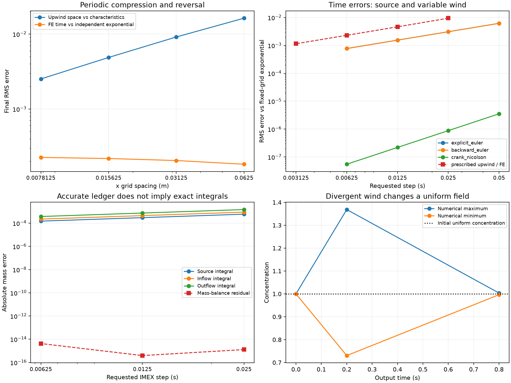

# Prescribed transport, time-dependent sources and mass ledgers

Three independent reference families exercise the production solver. All fields are synthetic; there is no measured pollution or performance claim.

## Periodic conservative compression and reversal

The prescribed face velocity is u=a(t) sin(2 pi x/L), with a five-knot piecewise-linear amplitude that changes sign. The conservative equation is c_t=-div(u c). Starting from uniform c0, its exact density is c0/[cosh(s)+sinh(s) cos(2 pi x/L)], where s=(2 pi/L) integral(a). Inverse-characteristic angle differences give exact finite-volume cell averages. The input has zero final signed integral, so the continuous final density returns to uniform.

A separately assembled one-dimensional upwind matrix is advanced by ordered dense exponentials, split at every amplitude zero crossing. Matrices commute within a fixed-sign interval, not generally across sign changes. This fixed-grid reference isolates time error; its difference from the characteristic solution measures spatial error. Upwind diffusion does not reverse when the velocity reverses.

| nx | Spatial RMS | Time RMS | Time / space | Spatial order |
|---:|---:|---:|---:|---:|
| 16 | 0.016301097 | 0.00018281575 | 0.011214935004234696 | None |
| 32 | 0.0091514019 | 0.00020484148 | 0.02238361705709675 | 0.8329044113366127 |
| 64 | 0.0048738846 | 0.00021799307 | 0.04472676008004865 | 0.9089206794413218 |
| 128 | 0.0025180817 | 0.0002251522 | 0.08941417350074271 | 0.9527469721844274 |

Only x is refined and every field is constant in y. A constant-field nonconservative advection reference is deliberately retained as an error diagnostic at compression; it solves a different PDE. General divergent winds need not preserve maxima or variance.

## Time-dependent source with closed diffusion

The source is affine in time with a uniform mean and one exact cell-average cosine mode. A separately assembled closed diffusion matrix is augmented with clock and constant states; its exponential gives the fixed-grid reference. A continuous cosine-mode reference separately exposes spatial error. Nonzero diffusion keeps Crank–Nicolson time error nontrivial, although trapezoid source mass is exact for this affine source.

| Method | Finest RMS | Last time order | Source mass error |
|---|---:|---:|---:|
| explicit_euler | 0.00077127339 | 1.0000880595894246 | -0.00075 |
| backward_euler | 0.00077117974 | 0.9999128766509482 | 0.00075 |
| crank_nicolson | 5.5106646e-08 | 2.0000020943166987 | -6.6613381e-16 |

Prescribed-wind FE last time order: 1.0045674200687709; final RMS 0.0011454258.

## Open-boundary manufactured solution and complete mass ledger

Choose u=v0+a*x, c=c0+b*t, q=b+a*c, and left incoming concentration c. The right boundary is outflow and exterior diffusive flux is zero. This uniform spatial solution is exact for FE transport and IMEX to rounding, including an interior forcing knot at 0.37T. Both methods use the same configured scalar diffusion, which annihilates this uniform solution.

The continuous source, inflow and outflow integrals are evaluated analytically. The actual numerical stage ledger satisfies R=M-M0+out-in-source. Its three individual left-rule integrals are nevertheless first-order approximations. For each affine integrand, the independent predicted error is minus one half its slope times sum(actual_dt squared); the saved histogram includes knot/output split steps.

| Method | Finest field Linf | Source integral error | Inflow integral error | Outflow integral error | Balance residual |
|---|---:|---:|---:|---:|---:|
| advection_explicit | 4.6629367e-15 | -0.00014946 | -0.00022419 | -0.00037365 | 2.7755576e-15 |
| imex_euler | 1.1768364e-14 | -0.00014946 | -0.00022419 | -0.00037365 | 4.2188475e-15 |

## Archive and scope

The archive contains normalized configuration, all input forcing arrays, numerical and independent reference fields, reference matrices, every solver diagnostic, CSV, this report, the figure, the complete Python source snapshot and dependency lock. Admission bounds saved array bytes, estimated cell updates, reference dimensions and scaled rates. It is not a process-memory or time limit. Verification checks bytes, inventories, schema and identities; it does not rerun or mathematically certify the results.

Verify: `python -m scripts.run_forced_transport_experiments --verify BUNDLE`. Replot: `--replot BUNDLE` writes a fresh sibling PNG outside the sealed bundle. Replay inside `source_snapshot/` using the prepared interpreter: `python -B -m scripts.run_forced_transport_experiments --config ../config.json --output /absolute/new/output`.

- Synthetic manufactured references, not measured pollution or observational calibration.
- Only y-independent periodic spatial refinement is measured; no general 2-D spatial convergence claim.
- Piecewise-linear prescribed inputs are the model. No inference about unresolved real winds, impulses, or discontinuous source signals.
- Conservative -div(u*c) differs from passive -u dot grad(c) for divergent wind; compression can increase the maximum and variance.
- Temporal references hold the spatial discretization fixed; characteristic cell averages separately measure spatial error.
- Open boundaries prescribe incoming advective concentration and zero exterior diffusive flux, not diffusion Dirichlet conditions.
- Ledger closure uses actual numerical stage quadrature and does not certify accurate individual physical time integrals.
- All references are floating-point, not outward-rounded mathematical certificates; no runtime or peak-memory guarantee.

