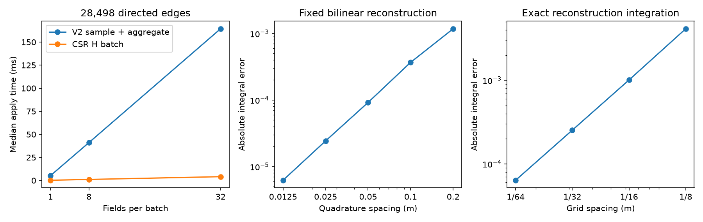

# Spatial observation performance and convergence

Local spatial observation benchmark only. No PDE, dynamic routing or whole-application speedup claimed. Reconstruction study uses point samples, not FV cell averages.

| Fields | V2 sample median ms | CSR median ms | Ratio | Max difference |
|---:|---:|---:|---:|---:|
| 1 | 5.2093 | 0.2395 | 21.75 | 1.705e-13 |
| 8 | 41.0056 | 1.1027 | 37.19 | 2.274e-13 |
| 32 | 164.4302 | 4.1202 | 39.91 | 3.411e-13 |

Common graph load: 462.065 ms. Generation of 32 fields: 5.130 ms.
Sampling setup: 5.892 ms. Measured H build: 71.874 ms. CSR cold setup: 77.766 ms; CSR storage: 2725244 bytes.
reused previously constructed samples. cold observation costs start from a parsed graph and prepared fields; sum separately measured setup and median apply, not an independently repeated cold-start benchmark.
Setup is not included in apply ratios. Raw repetitions, setup-inclusive times and amortization estimates are in benchmark.json.
Frozen V2 and current interpolation agree to 0.000e+00; Gauss reference agrees with the independent analytic polyline integral to 2.220e-16.



The exact measurement script is preserved as `measurement_source.py`; its SHA-256 matches `benchmark_script_sha256` in the unchanged raw JSON. Plot tick labels were subsequently corrected without repeating measurements. From the project root, regenerate only the PNG from the saved data with:

```bash
.venv/bin/python scripts/benchmark_observations.py --replot reports/research/observation_baseline/benchmark.json
```
