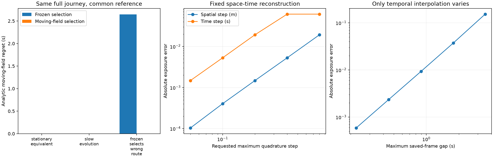

# Time-aware trajectory and routing study

All routes are evaluated over their full physical journey. The concentration and graph are synthetic.

| Case | Frozen selected | Moving selected | Frozen regret (s) | Moving regret (s) |
|---|---:|---:|---:|---:|
| stationary_equivalent | 0 | 0 | 0 | 0 |
| slow_evolution | 0 | 0 | 0 | 0 |
| frozen_selects_wrong_route | 0 | 1 | 2.64589554 | 0 |

The common reference is an independent closed-form continuous cosine-diffusion line integral, including the time of every segment. Initial PDE values are exact cell averages.

The polynomial reconstruction study includes nonuniform frame times, repeated edges and stationary waits. Grid/frame-split Gauss2 integrates its cubic trajectory restriction to roundoff. Trapezoid and output-frame refinement are measured separately.

Time-expanded results retain a label per node and arrival-time state. Arrival rounding creates an explicit charged wait; the destination terminates at actual arrival. Each result is optimal only on its stated finite rounded graph. Voluntary waiting is disabled in this refinement experiment and covered separately in tests.

No speedup or real-world pollution claim is made. Raw arrays, per-path results, source snapshots, and all assumptions are in this bundle.

Replay from source_snapshot with the prepared Python interpreter: `PYTHONDONTWRITEBYTECODE=1 python -m scripts.run_temporal_experiments --config ../config.json --output /absolute/new/output`. Bytecode writes are disabled to preserve the sealed source archive. Verify with `--verify BUNDLE`; redraw without recomputation with `--replot BUNDLE` (creates a separate sibling PNG).

