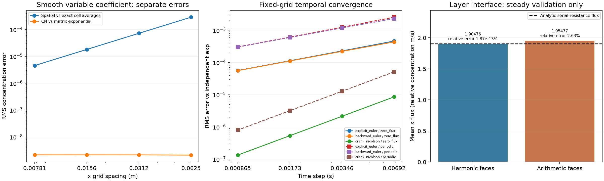

# Variable diffusion: spatial, temporal and interface references

This bundle runs the production FE/BE/CN solver. Three distinct references separate spatial, temporal and material-interface errors. No performance or physical pollution claim is made.

| nx | Spatial RMS vs exact cell averages | CN temporal RMS | Temporal / spatial error | Observed spatial order |
|---:|---:|---:|---:|---:|
| 16 | 0.00028921424 | 2.0987165e-09 | 7.25662e-06 | unresolved |
| 32 | 7.2639725e-05 | 2.1270833e-09 | 2.92826e-05 | 1.9933079635982256 |
| 64 | 1.8181012e-05 | 2.1343515e-09 | 0.000117395 | 1.9983262406659783 |
| 128 | 4.5465716e-06 | 2.1361696e-09 | 0.000469842 | 1.9995815121922738 |

The smooth mode solves the unforced closed-boundary PDE. Both initial and reference data are exact sinc cell averages. Only x is refined; y is constant. The fixed production-matrix exponential isolates CN time error. An unresolved ratio or large temporal error does not establish spatial order.

| Boundary | Method | Finest temporal RMS | Last observed temporal order |
|---|---|---:|---:|
| zero_flux | explicit_euler | 5.6373052e-05 | 1.0058868379045947 |
| zero_flux | backward_euler | 5.5919977e-05 | 0.9942440535285653 |
| zero_flux | crank_nicolson | 1.3397394e-07 | 2.000185319878777 |
| periodic | explicit_euler | 0.00030416924 | 1.0088468870586782 |
| periodic | backward_euler | 0.00030050473 | 0.9913581891395032 |
| periodic | crank_nicolson | 7.9925124e-07 | 2.0001301185408082 |

Temporal tests hold a small rectangular grid fixed and use an independently assembled face matrix and symmetric eigendecomposition exponential. Their errors measure time integration, separately from continuous-PDE spatial error.

| Interface face rule | Solution RMS error | Mean x flux | Maximum x flux error |
|---|---:|---:|---:|
| harmonic | 2.4389378e-16 | 1.9047619 | 1.3322676e-14 |
| arithmetic | 0.010214992 | 1.9547669 | 0.050005021 |

Analytic serial-resistance flux: 1.904761905 relative-concentration m/s.

The steady interface validation adds left/right half-cell Dirichlet terms only to a COPY of the production closed matrix. The exact piecewise-linear profile and every x/y face flux are retained. Arithmetic face means are an explicitly different comparison discretization, never the production output.

Configuration, raw arrays, independent reference matrices, diagnostics, source snapshot and dependency lock are archived. Admission limits aggregate array bytes, estimated cell updates and spatial exponential T*maxOutgoing; it does not cap LU/eigensolver peak memory or wall time. Floating-point references are not interval-certified mathematical proofs.

Verify: `python -m scripts.run_variable_diffusion_experiments --verify BUNDLE`. Replot: `--replot BUNDLE` creates a fresh sibling PNG outside the sealed bundle. Replay from `source_snapshot/` with the prepared interpreter: `python -B -m scripts.run_variable_diffusion_experiments --config ../config.json --output /absolute/new/output`.

