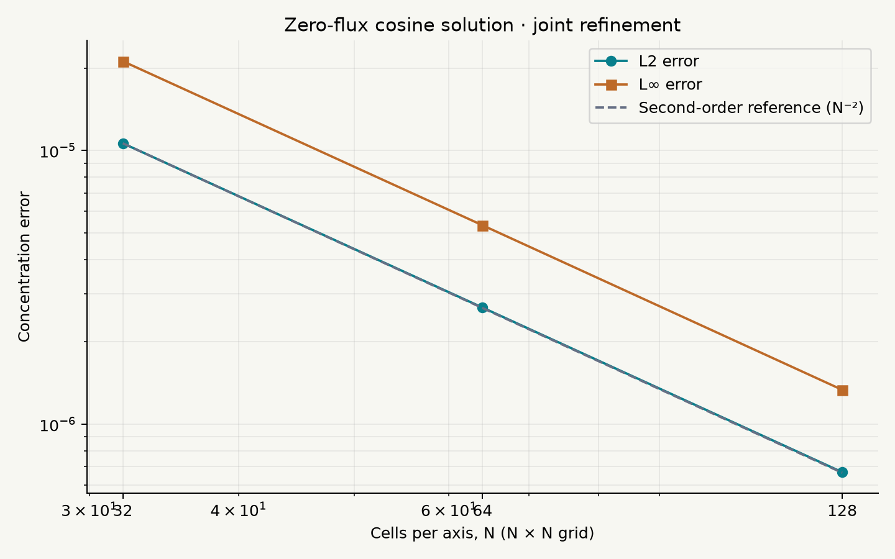

# Numerical validation

All required checks: **PASS**.

| Check | Result |
|---|---|
| constant_field | PASS |
| mass_conservation | PASS |
| nonnegative | PASS |
| second_order_joint_convergence | PASS |

Maximum relative mass drift: `4.187e-16`. Constant-state maximum error: `0.000e+00`. Minimum concentration: `8.592e-98`. No negative-value clipping is used.

Analytical solution: `1 + 0.5 exp(-2 pi² t) cos(pi x) cos(pi y)` on the unit square, zero-flux walls, κ = 1, final time 0.02.

| Grid | L2 error | L∞ error | Observed joint order | Solve (ms) |
|---|---|---|---|---|
| 32² | 1.0629173e-05 | 2.1207163e-05 | — | 2.12 |
| 64² | 2.6673997e-06 | 5.3315863e-06 | 1.99452 | 14.83 |
| 128² | 6.6748094e-07 | 1.3347608e-06 | 1.99864 | 160.80 |

Euler is first order in time; dt=0.1 h² makes the combined spatial/time refinement approximately second order.

The spatial flux across each interior face is applied with opposite signs to its two neighboring cells. Exterior face fluxes are zero. Stability uses dt ≤ 0.9 / [2κ(1/dx² + 1/dy²)]. Concentration has no per-frame renormalization.

Reproduce with `.venv/bin/python -m scripts.run_experiments`; raw diagnostics are in [validation.json](validation.json).
